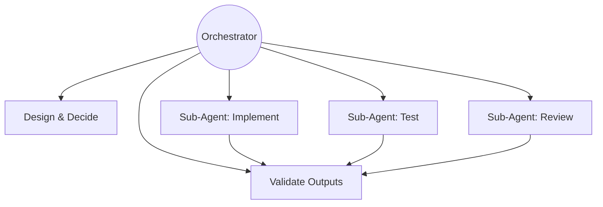
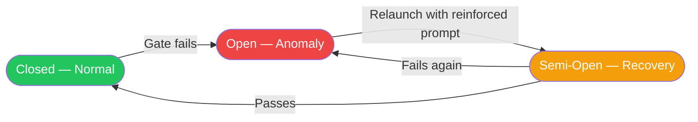
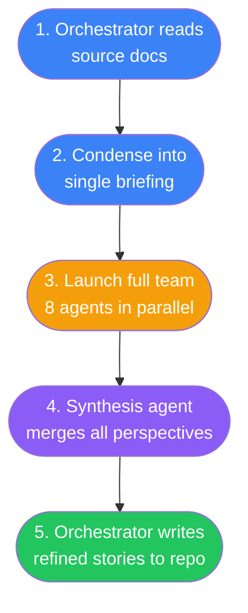
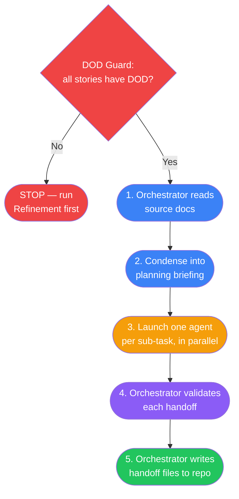

# AGENTS.md — TaskFlow Project

## Project Identity

**Name**: TaskFlow
**Type**: Full-stack web application (technical interview exercise)
**Domain**: Task Management System
**Constraint**: Single public GitHub repository, all deliverables unified
**Deadline**: 2026-07-13 at 11:00 CDT (Mexico time)

## Deliverables

- [ ] Backend API with Clean Architecture and TDD
- [x] Frontend scaffold with health semaphore (Angular 22.0.6, Docker, nginx)
- [ ] Frontend CRUD operations
- [ ] GenAI process documentation (mandatory)
- [x] README with setup instructions and thought process
- [ ] Seeded data and credentials for demo

## Repository Rules

- Single repo for all deliverables
- Public repository on GitHub
- No further work allowed after submission

## Project Phases


## Current Phase

**Implementation** — EP00 (infra bootstrap) done. Pivoted to full-stack vertical deliveries: (1) EP02 Tasks CRUD + EP04 task UI, (2) EP01 register/login + EP04 auth UI, (3) auth middleware + ownership wiring across all endpoints. EP03 runs in parallel. Infrastructure from EP00 materializes during functional epics.

## Conventions

### Documentation
- All planning documents are technology-agnostic until architecture phase
- User stories follow standard format: persona, action, value
- Acceptance criteria use Given/When/Then format
- Language: English for all artifacts in the repository

### Git Branching
- **No direct commits to `main`** — all work goes through branches
- Feature branches: `feature/<epic-or-scope>` (e.g., `feature/EP00-infrastructure`)
- Task branches (optional): `feature/<scope>/<task>` — branched from the feature branch
- Worktrees may be used for parallel task branches off the same feature branch
- When a feature branch is complete, **squash merge** into `main`
- Delete the feature branch after merge

### Git Commits
- Conventional commits: `type(scope): description`
- Types: `docs`, `feat`, `fix`, `refactor`, `test`, `chore`
- Atomic commits — one logical change per commit
- Commits on feature/task branches can be granular — the squash merge into `main` consolidates them

### Architecture (when phase begins)
- Clean Architecture: domain at the center, infrastructure at the edges
- Dependency rule: inner layers never depend on outer layers
- TDD: tests first, implementation second

## Agent Roles

### Orchestrator (Senku / main thread)
- **DOES NOT write code** — zero lines, no exceptions
- Orchestrates sub-agents for all implementation, testing, and code review
- Validates sub-agent outputs against specs and acceptance criteria
- Makes architecture and design decisions
- Writes and maintains documentation (epics, user stories, design docs)
- Manages project phases and transitions

### Sub-Agents (delegated workers)
- Receive specific, scoped tasks from the orchestrator
- Write code, run tests, perform builds
- Return results for orchestrator validation
- Follow compact rules injected by the orchestrator

### Delegation Contract (mandatory for every sub-agent launch)
Every sub-agent MUST receive a **handoff file** following the
[Handoff Template](docs/process/handoff-template.md). The handoff has 11 sections:

1. **Metadata** — task ID, batch, epic, persona, model tier
2. **Objective** — 1-3 sentence north star
3. **Pre-Conditions** — checkable conditions before starting
4. **Context Bundle** — exact files with line ranges (minimize context waste)
5. **Deliverables** — files to create/modify with expected signatures
6. **Quality Gates** — ordered shell commands with pass criteria (copy-pasteable)
7. **Boundaries** — explicit OUT OF SCOPE list + scope termination conditions
8. **Anti-Patterns** — common mistakes: what / why it fails / do instead
9. **Rollback Guidance** — recovery path with 3-failure circuit breaker
10. **Compact Rules** — injected TASKFLOW-* blocks from this file (inline, not by path)
11. **Status Protocol** — machine-readable status block with gate results

No sub-agent launches without a completed handoff file. No ad-hoc prompts. No exceptions.
The orchestrator runs the [pre-flight checklist](docs/process/handoff-template.md#orchestrator-pre-flight-checklist)
before every delegation.



## Model Assignment

| Level | Model | Use When |
| ----- | ----- | -------- |
| Search | haiku | Grep, read docs, lint checks, exploratory reads |
| Implement | sonnet | Write code, tests, reviews, verify quality gates |
| Architect | opus | Design decisions, conflict resolution, multi-source synthesis |

With 6+ agents, model discipline multiplies savings. Never burn opus on a grep.

## Agent Naming and Personality

Every sub-agent receives a **name** and **expertise persona** based on the task:

| Task Type | Name Pattern | Expertise |
| --------- | ------------ | --------- |
| Schema/Types | Matt Pocock — TypeScript Educator | Zod schemas, type inference |
| Unit/Integration Tests | Kent C. Dodds — Testing Library Creator | Test architecture, AAA pattern |
| E2E Tests | Debbie O'Brien — Playwright Team PM | Playwright, POM patterns |
| API/Backend | Uncle Bob — Clean Architecture Author | SOLID, Clean Architecture, DI |
| Frontend | Sarah Drasner — VP of DX | Component design, state, a11y |
| DevOps/Docker | Kelsey Hightower — Cloud Native Pioneer | Containers, CI/CD, infra |
| Docs/Tech Writing | Daniele Procida — Diátaxis Creator | Documentation structure, clarity |

The persona sets the sub-agent's communication style and technical lens. It does NOT
override compact rules or project conventions.

## Sub-Agent Status Protocol

### Mandatory Status Block

Every sub-agent MUST include this block in its final response:

```text
Status: [IN_PROGRESS | BLOCKED | DONE | FAILED]
Progress: X/Y items
Blocker: (if applicable — describe exactly what blocks)
```

### Anti-Stall Rules

| Condition | Action |
| --------- | ------ |
| No status block returned | STALLED → kill + relaunch |
| BLOCKED > 1 iteration | Kill → reassign with blocker context |
| FAILED | Diagnose root cause before relaunch |
| Same gate fails 3 times | Reduce scope and relaunch |



### Escalation by Rejection

1. Gate fails → specific feedback with evidence → agent corrects
2. Same gate fails again → kill + clean relaunch
3. Third failure → diagnose root cause, relaunch with reduced scope

## Post-Delegation Checkpoint (PDC)

After EVERY sub-agent returns, the orchestrator runs these 4 steps **sequentially**:

1. **ECHO** — Print the gates from the delegation: `GATES: [gate1] | [gate2] | [gate3]`
2. **VERIFY** — For each gate: `GATE [name]: PASS|FAIL — [evidence]`
3. **MARK** — Update progress tracker NOW (checkbox + inline evidence)
4. **DECIDE** — Any FAIL → no advance. All PASS → `CHECKPOINT CLEAR`, proceed.

If step 3 is not completed, the orchestrator **CANNOT** launch another sub-agent.


## Scrum Ceremonies

### Refinement (Grooming)

Refines user stories for a batch before implementation begins. Produces DOD, DOR,
acceptance criteria, expected deliverables, test plan, and out-of-scope boundaries.

#### Process



**Step 1 — Orchestrator reads source docs** (inline, not delegated):
- Epic file (`docs/epics/EP0X-*.md`)
- User story files (`docs/user-stories/US-0XX-*.md`)
- Engineering addenda (`docs/epics/EP0X-engineering-addenda.md`)
- API contract (relevant sections)
- Prior grooming notes from engram

**Step 2 — Condense into single briefing**:
- Write a single markdown file to **scratchpad** (never committed)
- Contains: stories, acceptance criteria, engineering decisions, API contract, architecture scope, file blueprint, constraints
- This is the ONLY input the team receives — no file paths, no references to read

**Step 3 — Launch full scrum team** (8 agents in parallel via Workflow):
- Each agent receives the **full briefing text injected in their prompt**
- Each agent gets a **role-specific lens** (what to focus on)
- Each agent returns **structured JSON** via schema (not free text)
- **Zero file reads** by sub-agents — all context is pre-digested

| Role | Lens |
| ---- | ---- |
| Product Owner (PO) | Business value, AC completeness, user journey gaps, prioritization |
| Scrum Master (SM) | DOR/DOD specificity, story sizing, independence, process risks |
| Tech Lead (TL) | Architecture alignment, interface contracts, naming, TDD order |
| Frontend Engineer (FE) | Contract alignment with FE consumption, Zod schemas, forward planning |
| Business Analyst (BA) | Requirements completeness, edge cases, data validation, UX gaps |
| QA Engineer (QA) | Test cases, boundary values, negative scenarios, validation matrix |
| QA Automation (QA-Auto) | Unit test plan, mock strategy, test naming, coverage targets, TDD order |
| Infrastructure (Infra) | Package dependencies, project references, build impact, env vars |

**Step 4 — Synthesis** (single opus agent):
- Receives all 8 structured outputs
- Deduplicates, resolves conflicts (prefers conservative option)
- Produces final consolidated refinement with: DOD, DOR, acceptance criteria (Given/When/Then), deliverables (exact file paths), test plan (test names mapped to ACs), validation rules (where each runs), out-of-scope, prerequisites, TDD order, risks

**Step 5 — Orchestrator writes to repo**:
- Updates user story files with refined DOD, DOR, acceptance criteria, deliverables
- Creates/updates batch-specific refinement doc if needed
- These are REAL files (committed), not scratchpad

#### Schema Contract

Every team member returns the same structured schema per user story:

```text
{
  role: string,
  usXXX: {
    dor: string[],           — Definition of Ready (checkable conditions)
    dod: string[],           — Definition of Done (acceptance conditions)
    acceptance_criteria: [    — Refined Given/When/Then
      { id, given, when, then }
    ],
    deliverables: string[],  — Expected outputs (files, classes, tests)
    test_coverage: [          — Test cases mapped to ACs
      { test_name, maps_to, assertion }
    ],
    risks: string[],
    out_of_scope: string[]
  },
  cross_cutting: string[]    — Notes that apply to all stories
}
```

#### Anti-Patterns

| Anti-Pattern | Why It Fails | Do Instead |
| ------------ | ------------ | ---------- |
| Each agent reads source files | 8x redundant reads, context waste | Orchestrator reads once, injects text |
| Free-text agent output | Hard to merge, inconsistent | Structured JSON via schema |
| Launching agents without briefing | Agents hallucinate scope | Single briefing with all context |
| Writing refinement to scratchpad only | Lost after session | Write to real project files |
| Skipping synthesis | 8 unmerged perspectives | Single synthesis pass deduplicates |

#### Model Assignment

| Phase | Model | Reason |
| ----- | ----- | ------ |
| Orchestrator reads | — | Inline, no agent |
| Team members (8x) | sonnet | Structured analysis, not architecture |
| Synthesis | opus | Cross-perspective merge, conflict resolution |

### Planning (Sprint Planning)

Takes REFINED user stories for a batch (already carrying DOD, DOR, acceptance criteria, and
deliverables from Refinement) and decomposes the batch into sub-task **handoff files**
following the [Handoff Template](docs/process/handoff-template.md), ready for implementation
delegation.

#### Guard

Planning MUST NOT start unless every user story in scope already has a
`## Definition of Done (DOD)` section. If any story lacks DOD, planning stops and
Refinement runs first. No handoff file is produced from an ungroomed story.

#### Process



**Step 1 — Orchestrator reads source docs** (inline, not delegated):

- Refined user story files (`docs/user-stories/US-0XX-*.md`) — must already have DOD, DOR,
  acceptance criteria, deliverables
- Engineering addenda (`docs/epics/EP0X-engineering-addenda.md`) — batch plan and binding
  engineering decisions
- API contract (relevant endpoints)
- Handoff template (`docs/process/handoff-template.md`)
- Existing handoff files in `docs/handoffs/EP0X/` to avoid duplicates
- Prior planning from engram

**Step 2 — Condense into planning briefing**:

- Write a single markdown file to **scratchpad** (never committed)
- Contains: all refined stories with DOD/DOR/AC/deliverables/test plan, batch scope and
  constraints, the handoff template's 11-section structure, applicable engineering
  decisions, API contract details, and the orchestrator's own sub-task breakdown table
- This is the ONLY input the task agents receive — no file paths, no references to read

**Step 3 — Launch planning agents** (Workflow, parallel):

- **One agent per sub-task** (not per role — per TASK, unlike Refinement's role-based team)
- Each agent receives the full briefing plus its specific task scope
- Each agent produces one COMPLETE handoff file (all 11 sections) as structured output
- Model: sonnet, effort: high

**Step 4 — Orchestrator validates** (inline):

- Every relevant acceptance criterion is covered by a deliverable or quality gate
- Quality gates are copy-pasteable shell commands with explicit pass criteria
- Boundaries name at least 3 explicit OUT OF SCOPE items
- Anti-patterns section is populated, not left as a placeholder
- Handoff passes the [Pre-Flight Checklist](docs/process/handoff-template.md#orchestrator-pre-flight-checklist)

**Step 5 — Write handoff files to real project files**:

- Write to `docs/handoffs/EP0X/EP0X-B{N}-{NN}-{task-slug}.md`
- Create/update the batch plan tracking file if needed
- Save to engram

#### Anti-Patterns

| Anti-Pattern | Why It Fails | Do Instead |
| ------------ | ------------ | ---------- |
| Planning without DOD | Handoffs derive scope from DOD — missing DOD means hallucinated gates | Guard rejects; run Refinement first |
| Each agent reading source files | N-x redundant reads, context waste | Orchestrator reads once, injects text |
| Vague quality gates | Sub-agent can't self-verify, PDC fails | Every gate is a copy-pasteable shell command |
| Missing boundaries | Scope creep during implementation | Explicit OUT OF SCOPE list, minimum 3 items |
| One handoff per role instead of per task | Doesn't match implementation delegation model | One agent, one handoff, per sub-task |

#### Model Assignment

| Phase | Model | Reason |
| ----- | ----- | ------ |
| Orchestrator reads | — | Inline, no agent |
| Task agents (Nx) | sonnet | Structured writing, not architecture |
| Validation | — | Inline, orchestrator |

## Compact Rules for Sub-Agent Injection

### TASKFLOW-DOCS
- All planning docs are business-first, technology-agnostic
- User stories must have acceptance criteria in Given/When/Then
- No implementation details in user stories

### TASKFLOW-TEST-HARNESS
- Integration tests and E2E tests serve as the project's safety harness
- ALL tests must pass before any commit
- New features require corresponding tests FIRST (TDD: Red/Green/Refactor)
- Breaking an existing test is a blocking issue — fix before proceeding
- Backend: integration tests at API level (AAA pattern: Arrange/Act/Assert)
- Frontend: Playwright E2E regression tests
- Unit tests cover Domain invariants and Application use cases in isolation (mocked repos). Integration tests at API level remain the PRIMARY confidence layer. Both must pass.
- Tests map directly to user story acceptance criteria

### TASKFLOW-ANTI-DRIFT
- Respect the current phase — do not jump ahead
- Discovery phase: NO code, NO technology choices, NO architecture diagrams
- Every decision must trace back to a requirement or acceptance criterion
- Version pinning: ALL dependencies use exact versions, never floating (no ^, no ~, no latest)

### TASKFLOW-BUILD-PIPELINE
- Build pipeline has 5 sequential gated stages: setUp → build → test:static → test:dynamic → test:e2e
- Each stage gates the next — a failing stage STOPS the pipeline, no skipping allowed
- All build outputs go to `./artifacts/` (gitignored): dist/api, dist/web, testReports/api|e2e, openApi/
- E2E tests consume artifacts from BOTH api and web builds — they do NOT build anything themselves
- Same pipeline in every environment: local, CI, Docker — no environment-specific shortcuts
- PostgreSQL is the ONLY database engine — no EF Core InMemory, no SQLite, no in-memory substitutes
- Docker Compose topology: 3 containers (postgres:17.5, taskflow-api, taskflow-web) — all from pinned images
- Env vars come from `.env` file, validated at startup — fail-fast with named error on missing vars
- `.env.example` committed with placeholders, `.env` gitignored
- All dependency versions pinned in [README — Version Manifest](README.md#version-manifest) — single source of truth
