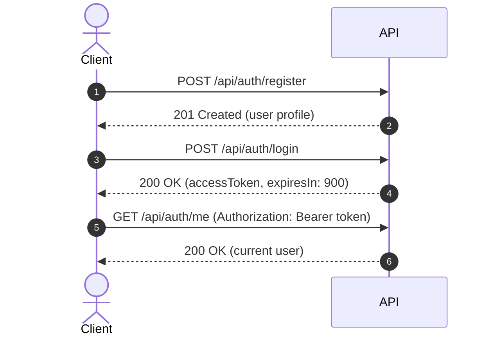

# TaskFlow — Task Management System

A full-stack task management application built with ASP.NET Web API, Angular, and PostgreSQL,
following Clean Architecture principles and Test-Driven Development.

## Quick Start

```bash
# Clone and run — requires only Docker
git clone <repo-url>
cd TaskFlow
docker compose up
```

| Service | URL | Description |
| ------- | --- | ----------- |
| Frontend | `http://localhost:${WEB_PORT}` | Angular SPA (default: 4200) |
| API | `http://localhost:${API_PORT}` | ASP.NET Web API (default: 5000) |
| API Health | `http://localhost:${API_PORT}/health` | Liveness + DB connectivity check |
| PostgreSQL | — | Database (internal to Docker network, not exposed to host) |

> Ports are configured via `API_PORT` and `WEB_PORT` in the `.env` file. See `.env.example` for defaults.

## Demo Credentials

> **Current implementation status**: real JWT-based identity (`GET /api/auth/me`, `[Authorize]`
> on `/api/tasks/*`) is scheduled for Batch 5 (see [EP02 Engineering Addenda — Batch
> Plan](docs/epics/EP02-engineering-addenda.md#12-batch-plan)) and is not wired into
> `Program.cs` yet. Until then, `/api/tasks/*` endpoints run under a hardcoded seed identity
> (`SeedCurrentUserContext`) instead of a token-derived one. There is no pre-seeded login
> account — register a user via `POST /api/auth/register` to obtain real credentials. See
> [Authentication](#authentication) below for the full flow and current gaps.

| Seed value | Value | Notes |
| ---------- | ----- | ----- |
| Seed owner ID | `01961234-5678-7abc-def0-123456789abc` | `SeedIdentity.SeedOwnerId` — the fixed owner used by `SeedCurrentUserContext` for all `/api/tasks/*` requests today |
| Second seed owner ID | `02961234-5678-7abc-def0-123456789abc` | `SeedIdentity.SeedOwnerId2` — used only by integration tests to prove ownership isolation |

These are not login credentials — they are placeholder identity values baked into the API
until real JWT-derived ownership ships. See
[`src/TaskFlow.Infrastructure/Identity/SeedIdentity.cs`](src/TaskFlow.Infrastructure/Identity/SeedIdentity.cs).

## Version Manifest

Single source of truth for every pinned dependency. All other documents link here instead of
hardcoding versions. Updated as dependencies are added during implementation.

### Runtime

| Dependency | Version | Role |
| ---------- | ------- | ---- |
| .NET | 10.0 (LTS) | Backend SDK and runtime |
| ASP.NET Core | 10.0 | Web API framework |
| PostgreSQL | 17.5 | Database engine (Docker image: `postgres:17.5`) |
| Angular | 22.0.6 | Frontend SPA framework |
| Node.js | 22.x (LTS) | Frontend build toolchain |
| pnpm | 11.11.0 | Frontend package manager |
| nginx | 1.27 | Frontend static file server (Docker) |

### Backend Libraries (NuGet)

| Package | Version | Role |
| ------- | ------- | ---- |
| Microsoft.EntityFrameworkCore | 10.0.9 *(Batch 2)* | ORM — LINQ-only data access (no raw SQL) |
| Npgsql.EntityFrameworkCore.PostgreSQL | 10.0.3 *(Batch 2)* | EF Core PostgreSQL provider |
| Npgsql | 10.0.3 | PostgreSQL driver (used by EF Core provider) |
| AspNetCore.HealthChecks.NpgSql | 9.0.0 | `/health` DB connectivity probe |
| FluentValidation | — | Request DTO validation |
| Microsoft.AspNetCore.OpenApi | 10.0.9 | OpenAPI spec generation |

### Backend Test Libraries (NuGet)

| Package | Version | Role |
| ------- | ------- | ---- |
| xUnit | — | Test framework |
| NSubstitute | — | Mocking library (unit tests) |
| Testcontainers.PostgreSql | — | PostgreSQL container for integration tests |
| Respawn | — | Database reset between integration tests |
| Microsoft.AspNetCore.Mvc.Testing | built-in | `WebApplicationFactory` for API tests |

### Frontend Libraries (npm)

| Package | Version | Role |
| ------- | ------- | ---- |
| TypeScript | 6.0.3 | Type-safe frontend development |
| Zod | 4.4.3 | API response validation (contract enforcement) |
| Tailwind CSS | — | Utility-first CSS framework |

### Frontend Test Libraries (npm)

| Package | Version | Role |
| ------- | ------- | ---- |
| Playwright | 1.61.1 | E2E browser tests |
| Vitest | 4.1.10 | Unit test runner (Angular component tests) |

### Infrastructure

| Tool | Version | Role |
| ---- | ------- | ---- |
| Docker Engine | 27.x+ | Container runtime |
| Docker Compose | v2 | Multi-container orchestration |
| ESLint | — | Linting (FE) |
| Prettier | 3.9.5 | Formatting (FE) |

> **`—`** = exact version will be pinned during implementation and updated here.
> No `^`, no `~`, no `latest`. See [Tech Stack — Decision 8](docs/architecture/tech-stack.md#decision-8-dependency-version-pinning).

## Tech Stack

For rationale behind each technology choice, see [Tech Stack decisions](docs/architecture/tech-stack.md).
All versions are pinned in the [Version Manifest](#version-manifest) above.

## Architecture

Clean Architecture with four layers — Domain at the center, Infrastructure at the edges.

```text
TaskFlow.sln
├── src/
│   ├── TaskFlow.Domain/           # Entities, interfaces, exceptions
│   ├── TaskFlow.Application/      # Use cases, DTOs, validation
│   ├── TaskFlow.Infrastructure/   # EF Core, JWT, repositories
│   └── TaskFlow.API/              # Controllers, middleware
├── tests/
│   ├── TaskFlow.Domain.Tests/     # Unit tests (domain logic)
│   ├── TaskFlow.Application.Tests/# Unit tests (use cases, mocked repos)
│   └── TaskFlow.IntegrationTests/ # API-level integration tests
└── e2e/                           # Playwright E2E tests
```

Full architecture documentation: [docs/architecture/](docs/architecture/)

## User Story

> As a user, I want to manage my personal tasks — create them, track their status, update
> details, and remove completed ones — through a simple web interface that requires me to
> log in so my tasks stay private.

Detailed user stories and acceptance criteria: [docs/INDEX.md](docs/INDEX.md)

## Thought Process

<!-- TODO: Fill during/after implementation -->

### Approach

1. **Discovery first** — decomposed the challenge into epics and user stories before writing
   any code. Every acceptance criterion traces back to a PDF requirement.
2. **Architecture before implementation** — documented Clean Architecture layers, API contract,
   and testing strategy as a blueprint for AI-assisted development.
3. **Tests as guardrails** — TDD at the integration level ensures the full pipeline works.
   Unit tests cover Domain invariants and Application logic in isolation.
4. **Docker for reproducibility** — same PostgreSQL, same pipeline, same artifacts in every
   environment. `docker compose up` is the only command the evaluator needs.

### Key Decisions

| Decision | Rationale |
| -------- | --------- |
| PostgreSQL over SQLite | Same engine in dev/test/demo — no fidelity mismatch |
| Integration tests as primary layer | For CRUD apps, full-pipeline tests catch more real bugs than isolated unit tests |
| Angular over React | Candidate expertise + existing production-ready base project |
| Exact version pinning | Reproducible builds regardless of when the repo is cloned |

### GenAI Usage

See [docs/epics/EP03-genai-documentation.md](docs/epics/EP03-genai-documentation.md) for
the full GenAI process documentation, including prompts, outputs, and validation.

## API Reference

| Method | Path | Auth | Description |
| ------ | ---- | ---- | ----------- |
| GET | `/health` | Public | Liveness + DB connectivity check |
| POST | `/api/auth/register` | Public | Register a new user |
| POST | `/api/auth/login` | Public | Log in, receive JWT |
| GET | `/api/auth/me` | Bearer | Current user profile *(planned — Batch 5, not yet implemented)* |
| POST | `/api/tasks` | Bearer *(planned)* | Create a task |
| GET | `/api/tasks` | Bearer *(planned)* | List tasks (paginated, optional `?status=` filter) |
| GET | `/api/tasks/{id}` | Bearer *(planned)* | View task detail |
| PATCH | `/api/tasks/{id}` | Bearer *(planned)* | Update a task |
| DELETE | `/api/tasks/{id}` | Bearer *(planned)* | Delete a task |

Full contract: [docs/architecture/api-contract.md](docs/architecture/api-contract.md)

## Authentication

TaskFlow uses stateless JWT bearer authentication. Full technical decisions live in
[EP02 Engineering Addenda](docs/epics/EP02-engineering-addenda.md); this section covers the
practical flow.

> **Implementation status**: `POST /api/auth/register` and `POST /api/auth/login` are
> implemented and issue real JWTs. `GET /api/auth/me` and JWT-enforced `[Authorize]` on
> `/api/tasks/*` are **not yet wired into `Program.cs`** — `/api/tasks/*` currently runs
> under a hardcoded seed identity (see [Demo Credentials](#demo-credentials)). This gap is
> scheduled for Batch 5 per the [EP02 batch plan](docs/epics/EP02-engineering-addenda.md#12-batch-plan).

### Flow: register → login → use the token



1. **Register** an account with `POST /api/auth/register`.
2. **Log in** with `POST /api/auth/login` to receive a short-lived JWT.
3. **Use the token** on every protected request via the `Authorization` header.
4. **Re-login** once the token expires (15 minutes) — there is no refresh token.

### `POST /api/auth/register`

**Request**:

```json
{
  "email": "jane@example.com",
  "name": "Jane Doe",
  "password": "Str0ng!Pass"
}
```

**Response — `201 Created`**:

```json
{
  "id": "01961234-89ab-7cde-f012-3456789abcde",
  "email": "jane@example.com",
  "name": "Jane Doe",
  "createdAt": "2026-07-11T12:00:00Z"
}
```

**curl**:

```bash
curl -X POST http://localhost:${API_PORT}/api/auth/register \
  -H "Content-Type: application/json" \
  -d '{"email":"jane@example.com","name":"Jane Doe","password":"Str0ng!Pass"}'
```

**Validation rules**: see [Password Policy](#password-policy) and [Email Rules](#email-rules)
below. Errors: `400` (missing/invalid field, weak password), `409` (email already registered).

### `POST /api/auth/login`

**Request**:

```json
{
  "email": "jane@example.com",
  "password": "Str0ng!Pass"
}
```

**Response — `200 OK`**:

```json
{
  "accessToken": "eyJhbGciOiJIUzI1NiIs...",
  "tokenType": "Bearer",
  "expiresIn": 900,
  "user": {
    "id": "01961234-89ab-7cde-f012-3456789abcde",
    "email": "jane@example.com",
    "name": "Jane Doe"
  }
}
```

**curl**:

```bash
curl -X POST http://localhost:${API_PORT}/api/auth/login \
  -H "Content-Type: application/json" \
  -d '{"email":"jane@example.com","password":"Str0ng!Pass"}'
```

Errors: `400` (missing field), `401` (invalid email or password — same generic message for
both cases, to prevent user enumeration), `429` (rate limited, see below).

### `GET /api/auth/me` *(planned — not yet implemented)*

Once wired, this endpoint returns the authenticated user's profile and requires a Bearer
token. Response shape mirrors the register response:

```json
{
  "id": "01961234-89ab-7cde-f012-3456789abcde",
  "email": "jane@example.com",
  "name": "Jane Doe",
  "createdAt": "2026-07-11T12:00:00Z"
}
```

**curl** (once implemented):

```bash
curl http://localhost:${API_PORT}/api/auth/me \
  -H "Authorization: Bearer <accessToken>"
```

Errors: `401` (missing, invalid, or expired token).

### Token usage

Include the JWT from the login response on every protected request:

```text
Authorization: Bearer <accessToken>
```

### Token expiry

| Parameter | Value |
| --------- | ----- |
| Expiry | 15 minutes |
| Refresh token | None — out of scope. Re-login when the token expires |
| Algorithm | HS256 |
| Claims | `sub` (user ID, UUID v7), `email`, `name` |

### Password Policy

| Rule | Value |
| ---- | ----- |
| Minimum length | 8 characters |
| Maximum length | 72 characters |
| Uppercase required | At least 1 |
| Digit required | At least 1 |
| Special character required | At least 1 |

Passwords are hashed with BCrypt (work factor 12 in production, work factor 4 in integration
tests for speed). Enforced by FluentValidation on the register request.

### Email Rules

| Rule | Behavior |
| ---- | -------- |
| Case | Lowercase only |
| Uppercase input | Rejected with `400 Bad Request` |
| Uniqueness | Case-insensitive unique index (PostgreSQL `LOWER()`) |

### Rate Limiting

`POST /api/auth/login` is limited to **5 requests per minute per IP** (fixed window).
Exceeding the limit returns `429 Too Many Requests` with a `Retry-After` header. This does
not apply to `/api/auth/register` or `/api/tasks/*`.

### Error Responses

Every error, on every endpoint, uses the same shape:

```json
{
  "status": 400,
  "error": "VALIDATION_ERROR",
  "message": "One or more fields are invalid.",
  "details": [
    { "field": "email", "issue": "Email must not contain uppercase characters." }
  ]
}
```

| Status | Meaning | Example cause |
| ------ | ------- | -------------- |
| 400 | `VALIDATION_ERROR` | Missing/invalid field, weak password, uppercase email |
| 401 | `UNAUTHORIZED` | Invalid login credentials, or missing/invalid/expired token |
| 409 | `CONFLICT` | Email already registered |
| 429 | `TOO_MANY_REQUESTS` | Login rate limit exceeded (`Retry-After` header included) |

`details` is omitted or empty for non-field errors (401, 409, 429); populated per invalid
field for `VALIDATION_ERROR`. Full contract:
[docs/architecture/api-contract.md § 2.3](docs/architecture/api-contract.md#23-standard-error-shape).

## API Documentation (OpenAPI / Swagger)

The API generates an OpenAPI document via the built-in
[`Microsoft.AspNetCore.OpenApi`](https://learn.microsoft.com/aspnet/core/fundamentals/openapi)
package (`builder.Services.AddOpenApi()` / `app.MapOpenApi()` in
[`Program.cs`](src/TaskFlow.API/Program.cs)) — **not** Swashbuckle/Swagger UI.

| Artifact | Location | Notes |
| -------- | -------- | ----- |
| OpenAPI JSON spec | `http://localhost:${API_PORT}/openapi/v1.json` | Only mapped when `ASPNETCORE_ENVIRONMENT=Development` (`app.Environment.IsDevelopment()` guard in `Program.cs`) |
| Interactive Swagger UI | **Not configured** | No `AddSwaggerGen`/`UseSwaggerUI` (Swashbuckle) is registered. Only the raw JSON document is exposed — there is no browsable UI at `/swagger` today. Recommended addition: `Swashbuckle.AspNetCore` (or `Scalar.AspNetCore` for a lighter UI on top of the existing `AddOpenApi()` document) if an interactive explorer is needed |
| OpenAPI snapshots | [`docs/architecture/openapi-snapshots/`](docs/architecture/openapi-snapshots/) | Hand-curated example **response bodies** (not full OpenAPI documents) captured per endpoint for documentation/regression reference, e.g. [`create-task-201.json`](docs/architecture/openapi-snapshots/create-task-201.json). Add one file per notable request/response example as new endpoints ship |

> Note: the default port above assumes the API is run outside Docker with `dotnet run`
> (Kestrel binds to `API_PORT` from the environment). Confirm the effective `API_PORT` in
> your `.env` — see [Quick Start](#quick-start).

## Running E2E Tests

Requires the Docker stack running and Playwright browsers installed.

```bash
# 1. Start the stack
docker compose up -d

# 2. Install Playwright browsers (one-time)
cd e2e && npx playwright install chromium

# 3. Run tests
WEB_PORT=4200 API_PORT=3000 npx playwright test
```

Environment variables `WEB_PORT` and `API_PORT` are required (no defaults — Zod validation
enforces this). See [e2e/README.md](e2e/README.md) for details.

## License

This project was created as a technical interview exercise for Ballast Lane Applications.
