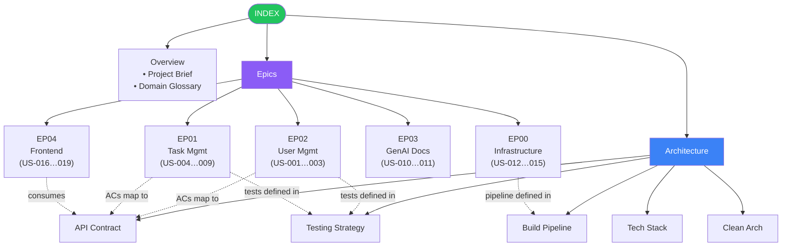

# TaskFlow Documentation Index

TaskFlow is a task management system with user authentication and personal task CRUD, built with
ASP.NET Web API, Clean Architecture, and TDD.

## Document Map

## Project Overview

- [x] [Project Brief](project-brief.md) — vision, deliverables, constraints, evaluation criteria
- [x] [Domain Glossary](domain-glossary.md) — ubiquitous language, entity relationships

## Epics

- [x] [EP00 — Project Infrastructure](epics/EP00-project-infrastructure.md) _(documentation/planning complete)_
  - [x] [US-012 — Docker Multi-Stage Build](user-stories/US-012-docker-multi-stage-build.md)
  - [x] [US-013 — Docker Compose Environment](user-stories/US-013-docker-compose-environment.md)
  - [x] [US-014 — Test Infrastructure](user-stories/US-014-test-infrastructure.md)
  - [x] [US-015 — Seed Data and Demo Credentials](user-stories/US-015-seed-data-and-credentials.md)
- [ ] [EP02 — User Management](epics/EP02-user-management.md)
  - [ ] [US-001 — User Registration](user-stories/US-001-user-registration.md)
  - [ ] [US-002 — User Login](user-stories/US-002-user-login.md)
  - [ ] [US-003 — Protected Access](user-stories/US-003-protected-access.md)
- [ ] [EP01 — Task Management](epics/EP01-task-management.md)
  - [ ] [US-004 — Create Task](user-stories/US-004-create-task.md)
  - [ ] [US-005 — List Tasks](user-stories/US-005-list-tasks.md)
  - [ ] [US-006 — View Task Detail](user-stories/US-006-view-task-detail.md)
  - [ ] [US-007 — Update Task](user-stories/US-007-update-task.md)
  - [ ] [US-008 — Delete Task](user-stories/US-008-delete-task.md)
  - [ ] [US-009 — Filter Tasks by Status](user-stories/US-009-filter-tasks-by-status.md)
- [ ] [EP03 — GenAI Process Documentation](epics/EP03-genai-documentation.md)
  - [ ] [US-010 — Prompt Documentation](user-stories/US-010-prompt-documentation.md)
  - [ ] [US-011 — AI Output Validation Report](user-stories/US-011-ai-output-validation.md)
- [ ] [EP04 — Frontend (Angular)](epics/EP04-frontend.md)
  - [ ] [US-016 — Login & Registration Screen](user-stories/US-016-login-screen.md)
  - [ ] [US-017 — Task List View](user-stories/US-017-task-list-view.md)
  - [ ] [US-018 — Task Form (Create/Edit)](user-stories/US-018-task-form.md)
  - [ ] [US-019 — Responsive Layout & Navigation](user-stories/US-019-responsive-layout.md)

## Architecture

- [x] [Tech Stack](architecture/tech-stack.md) — technology decisions and tradeoffs
- [x] [Clean Architecture](architecture/clean-architecture.md) — layers, dependency rule, project structure
- [x] [API Contract](architecture/api-contract.md) — endpoint specifications, request/response shapes
- [x] [Testing Strategy](architecture/testing-strategy.md) — test levels, coverage mapping, TDD workflow
- [x] [Build Pipeline](architecture/build-pipeline.md) — artifacts system, gated stages, environment parity

## Process

- [x] [Process Protocols](process.md) — DOR, DOD, grooming, sprint planning, completion, handoff, contract validation
- [x] [Handoff Template](process/handoff-template.md) — task delegation format for sub-agents (11 sections, pre-flight checklist)

## Sprint Planning — Handoffs

### EP02 — Batch 0 (Infra Bootstrap)

- [x] [Batch 0 Plan](subtasks/EP02/batch-0-plan.md) — scope, dependency graph, execution order
  - [x] [EP02-B0-01 — Solution Scaffold](subtasks/EP02/EP02-B0-01-solution-scaffold.md)
  - [x] [EP02-B0-02 — Docker Compose + Environment](subtasks/EP02/EP02-B0-02-docker-environment.md)
  - [x] [EP02-B0-03 — Health Endpoint + Program.cs](subtasks/EP02/EP02-B0-03-health-endpoint.md)

## Navigation Notes

- Implementation order: EP00 (infrastructure) → EP01 (tasks CRUD, full-stack) → EP02 (register/login, full-stack) → auth middleware + ownership wiring. EP03 (GenAI docs) runs in parallel throughout.
- Every document links back to this index via a breadcrumb header at the top.
- Epics link down to their user stories and to related architecture documents.
- User stories link up to their epic and out to relevant API contract and testing strategy sections.
- EP00 and its user stories (US-012 through US-015) are linked to their respective files.
- The Build Pipeline document defines the gated stage contract that all environments must follow.
