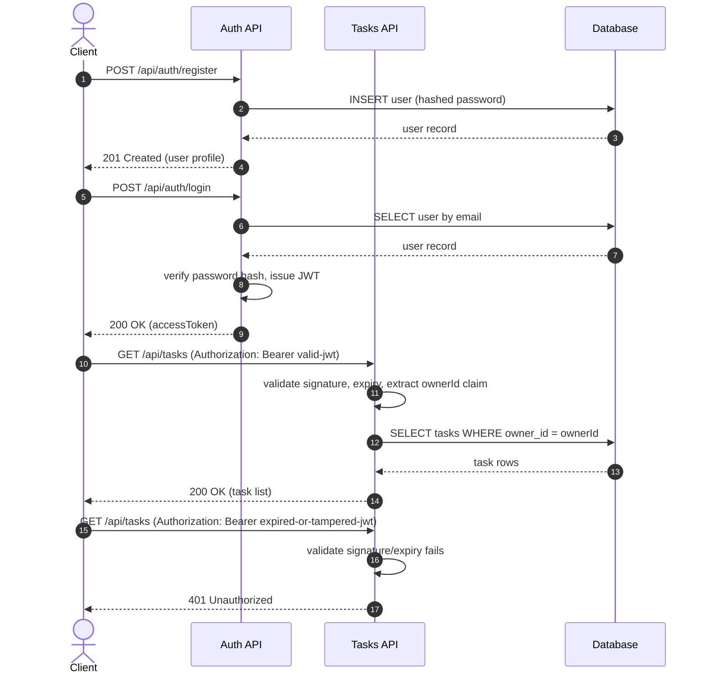

> [📚 INDEX](../INDEX.md) / [Architecture](../INDEX.md#architecture) / API Contract

# TaskFlow API Contract

Source of truth for every HTTP endpoint exposed by the TaskFlow ASP.NET Web API. This document
defines request/response shapes, authentication rules, status codes, and filtering behavior for
the two API groups: **Auth API** (public) and **Tasks API** (protected).

## Table of Contents

- [1. Endpoint Summary](#1-endpoint-summary)
- [2. Conventions](#2-conventions)
- [3. Auth API (Public)](#3-auth-api-public)
- [4. Tasks API (Protected)](#4-tasks-api-protected)
- [5. Authentication Flow](#5-authentication-flow)
- [6. Status Codes Reference](#6-status-codes-reference)
- [7. Filtering](#7-filtering)

## 1. Endpoint Summary

| Method | Path | Auth | US | Description |
| ------ | ---- | ---- | -- | ----------- |
| GET | `/health` | Public | US-012 | Liveness + database connectivity check |
| POST | `/api/auth/register` | Public | US-001 | Register a new user account |
| POST | `/api/auth/login` | Public | US-002 | Authenticate and receive a JWT access token |
| POST | `/api/tasks` | Bearer | US-004 | Create a new task owned by the caller |
| GET | `/api/tasks` | Bearer | US-005, US-009 | List the caller's tasks, optionally filtered by status |
| GET | `/api/tasks/{id}` | Bearer | US-006 | Retrieve a single task owned by the caller |
| PATCH | `/api/tasks/{id}` | Bearer | US-007 | Partially update an existing task owned by the caller |
| DELETE | `/api/tasks/{id}` | Bearer | US-008 | Permanently delete a task owned by the caller |

Every protected endpoint additionally satisfies US-003 (protected access, token validation, and
user isolation) since that user story is a cross-cutting requirement, not a standalone endpoint.

### User Story Coverage

- [x] [US-001 — User Registration](../user-stories/US-001-user-registration.md) → `POST /api/auth/register`
- [x] [US-002 — User Login](../user-stories/US-002-user-login.md) → `POST /api/auth/login`
- [x] [US-003 — Protected Access](../user-stories/US-003-protected-access.md) → enforced on all `/api/tasks/*` endpoints via JWT middleware
- [x] [US-004 — Create Task](../user-stories/US-004-create-task.md) → `POST /api/tasks`
- [x] [US-005 — List Tasks](../user-stories/US-005-list-tasks.md) → `GET /api/tasks`
- [x] [US-006 — View Task Detail](../user-stories/US-006-view-task-detail.md) → `GET /api/tasks/{id}`
- [x] [US-007 — Update Task](../user-stories/US-007-update-task.md) → `PATCH /api/tasks/{id}`
- [x] [US-008 — Delete Task](../user-stories/US-008-delete-task.md) → `DELETE /api/tasks/{id}`
- [x] [US-009 — Filter Tasks by Status](../user-stories/US-009-filter-tasks-by-status.md) → `GET /api/tasks?status={status}`

## 2. Conventions

### 2.1 Base URL

All paths below are relative to the API base URL (e.g., `https://api.taskflow.example/`).

### 2.2 Authentication Header

Protected endpoints require a Bearer token on every request:

```text
Authorization: Bearer <jwt>
```

### 2.3 Standard Error Shape

Every error response across every endpoint uses this shape, regardless of status code:

```jsonc
{
  "status": "number (required, matches HTTP status code)",
  "error": "string (required, machine-readable error code, e.g. 'VALIDATION_ERROR')",
  "message": "string (required, human-readable summary)",
  "details": [
    {
      "field": "string (optional, present for field-level validation errors)",
      "issue": "string (required, description of what is wrong with this field)"
    }
  ]
}
```

- `details` is an empty array or omitted when the error is not field-specific (e.g., 401, 404).
- `details` is populated with one entry per invalid field when the error is `VALIDATION_ERROR`
  (e.g., missing required field, malformed email, weak password, invalid status value).

## Health Endpoint (Public)

### `GET /health`

Returns application liveness and database connectivity status. Used by Docker `HEALTHCHECK`
and monitoring.

**Response `200 OK`:**

```jsonc
{
  "status": "ok",            // always "ok" if the process is running
  "liveSince": "string",     // ISO 8601 timestamp of when the application started
  "db": "ok"                 // "ok" if PostgreSQL responds, "down" if unreachable
}
```

No authentication required. No request body. This endpoint is outside the `/api` prefix.

## 3. Auth API (Public)

### 3.1 Register — `POST /api/auth/register`

Maps to [US-001](../user-stories/US-001-user-registration.md) (AC-1 through AC-4).

**Auth**: None (public).

**Request Body**:

```jsonc
{
  "email": "string (required, valid email format, unique)",
  "name": "string (required, non-empty)",
  "password": "string (required, must meet minimum strength requirements)"
}
```

**Success Response — `201 Created`**:

```jsonc
{
  "id": "string (uuid, required)",
  "email": "string (required)",
  "name": "string (required)",
  "createdAt": "string (ISO 8601 timestamp, required)"
}
```

**Error Responses**:

| Status | Condition | AC |
| ------ | --------- | -- |
| 400 | Missing required field (`email`, `name`, or `password`) | AC-4 |
| 400 | Email format invalid | AC-1 |
| 400 | Password does not meet minimum strength requirements | AC-3 |
| 409 | Email already registered | AC-2 |

### 3.2 Login — `POST /api/auth/login`

Maps to [US-002](../user-stories/US-002-user-login.md) (AC-1 through AC-3).

**Auth**: None (public).

**Request Body**:

```jsonc
{
  "email": "string (required)",
  "password": "string (required)"
}
```

**Success Response — `200 OK`**:

```jsonc
{
  "accessToken": "string (JWT, required)",
  "tokenType": "string (constant 'Bearer', required)",
  "expiresIn": "number (seconds until expiry, required)",
  "user": {
    "id": "string (uuid, required)",
    "email": "string (required)",
    "name": "string (required)"
  }
}
```

**Error Responses**:

| Status | Condition | AC |
| ------ | --------- | -- |
| 400 | Missing `email` or `password` | AC-3 |
| 401 | Invalid email or password (generic message, does not reveal which field is wrong) | AC-2 |

Note on AC-2: the `message` field must read identically whether the email does not exist or the
password is wrong (e.g., `"Invalid email or password."`), to prevent user enumeration.

## 4. Tasks API (Protected)

All endpoints in this section require a valid `Authorization: Bearer <jwt>` header. This satisfies
[US-003](../user-stories/US-003-protected-access.md):

- AC-1: a valid token allows the request to proceed.
- AC-2: a missing token returns `401 Unauthorized`.
- AC-3: an expired or tampered token returns `401 Unauthorized`.
- AC-4: every query and mutation is scoped to the authenticated user's own tasks (enforced at the
  data-access layer via the `owner_id` claim extracted from the token).

### 4.1 Create Task — `POST /api/tasks`

Maps to [US-004](../user-stories/US-004-create-task.md) (AC-1 through AC-5).

**Request Body**:

```jsonc
{
  "title": "string (required, non-empty)",
  "description": "string (optional)",
  "dueDate": "string (ISO 8601 date, optional, must be in the future if provided)"
}
```

`status` is never accepted in the request body — it always defaults to `"Pending"` on creation
(AC-5).

**Success Response — `201 Created`**:

```jsonc
{
  "id": "string (uuid, required)",
  "title": "string (required)",
  "description": "string (nullable)",
  "status": "string (constant 'Pending', required)",
  "dueDate": "string (ISO 8601 date, nullable)",
  "ownerId": "string (uuid, required)",
  "createdAt": "string (ISO 8601 timestamp, required)",
  "updatedAt": "string (ISO 8601 timestamp, required)"
}
```

**Error Responses**:

| Status | Condition | AC |
| ------ | --------- | -- |
| 400 | `title` missing or empty | AC-3 |
| 400 | `dueDate` is in the past | AC-4 |
| 401 | Missing, invalid, or expired token | US-003 |

### 4.2 List Tasks — `GET /api/tasks`

Maps to [US-005](../user-stories/US-005-list-tasks.md) (AC-1 through AC-4) and
[US-009](../user-stories/US-009-filter-tasks-by-status.md) (AC-1 through AC-4).

**Query Parameters**:

| Parameter | Type | Required | Description |
| --------- | ---- | -------- | ------------ |
| `status` | string, one of `Pending`, `In Progress`, `Completed` | No | Filter tasks to a single status. Omit to return all statuses (US-005 AC-1, US-009 AC-4) |

See [Section 7 — Filtering](#7-filtering) for full behavior.

**Success Response — `200 OK`**:

```jsonc
{
  "items": [
    {
      "id": "string (uuid, required)",
      "title": "string (required)",
      "status": "string (required, one of 'Pending' | 'In Progress' | 'Completed')",
      "dueDate": "string (ISO 8601 date, nullable)"
    }
  ],
  "count": "number (required, total items in the returned list)"
}
```

- `items` is `[]` (empty array) when the user has no tasks, or none match the filter — never an
  error (US-005 AC-2, US-009 AC-2).
- `items` only ever contains tasks owned by the caller (US-005 AC-3).
- Each item exposes at minimum `title`, `status`, and `dueDate` as required by US-005 AC-4.

**Error Responses**:

| Status | Condition | AC |
| ------ | --------- | -- |
| 400 | `status` query parameter has a value outside the valid enum | US-009 AC-3 |
| 401 | Missing, invalid, or expired token | US-003 |

### 4.3 View Task Detail — `GET /api/tasks/{id}`

Maps to [US-006](../user-stories/US-006-view-task-detail.md) (AC-1 through AC-3).

**Path Parameters**:

| Parameter | Type | Description |
| --------- | ---- | ----------- |
| `id` | string (uuid) | Identifier of the task to retrieve |

**Success Response — `200 OK`**:

```jsonc
{
  "id": "string (uuid, required)",
  "title": "string (required)",
  "description": "string (nullable)",
  "status": "string (required, one of 'Pending' | 'In Progress' | 'Completed')",
  "dueDate": "string (ISO 8601 date, nullable)",
  "ownerId": "string (uuid, required)",
  "createdAt": "string (ISO 8601 timestamp, required)",
  "updatedAt": "string (ISO 8601 timestamp, required)"
}
```

**Error Responses**:

| Status | Condition | AC |
| ------ | --------- | -- |
| 401 | Missing, invalid, or expired token | US-003 |
| 404 | Task does not exist, **or** exists but is owned by another user | AC-2, AC-3 |

Note on AC-3: a task owned by another user returns `404 Not Found`, never `403 Forbidden`, so that
callers cannot distinguish "does not exist" from "not yours" — preventing enumeration attacks.

### 4.4 Update Task — `PATCH /api/tasks/{id}`

Maps to [US-007](../user-stories/US-007-update-task.md) (AC-1 through AC-6).

**Path Parameters**:

| Parameter | Type | Description |
| --------- | ---- | ----------- |
| `id` | string (uuid) | Identifier of the task to update |

**Request Body** (partial update — only send fields that changed):

```jsonc
{
  "title": "string (optional, non-empty if provided)",
  "description": "string (optional, nullable)",
  "status": "string (optional, one of 'Pending' | 'In Progress' | 'Completed')",
  "dueDate": "string (ISO 8601 date, optional, nullable, past dates allowed on update)"
}
```

**Success Response — `200 OK`**:

```jsonc
{
  "id": "string (uuid, required)",
  "title": "string (required)",
  "description": "string (nullable)",
  "status": "string (required, one of 'Pending' | 'In Progress' | 'Completed')",
  "dueDate": "string (ISO 8601 date, nullable)",
  "ownerId": "string (uuid, required)",
  "createdAt": "string (ISO 8601 timestamp, required)",
  "updatedAt": "string (ISO 8601 timestamp, required)"
}
```

**Error Responses**:

| Status | Condition | AC |
| ------ | --------- | -- |
| 400 | `title` provided as an empty string | AC-6 |
| 400 | `status` provided with a value outside the valid enum | AC-4 |
| 401 | Missing, invalid, or expired token | US-003 |
| 404 | Task does not exist, or is owned by another user | AC-5 |

### 4.5 Delete Task — `DELETE /api/tasks/{id}`

Maps to [US-008](../user-stories/US-008-delete-task.md) (AC-1 through AC-4).

**Path Parameters**:

| Parameter | Type | Description |
| --------- | ---- | ----------- |
| `id` | string (uuid) | Identifier of the task to delete |

**Success Response — `204 No Content`**: empty body.

**Error Responses**:

| Status | Condition | AC |
| ------ | --------- | -- |
| 401 | Missing, invalid, or expired token | US-003 |
| 404 | Task does not exist (including a task already deleted), or owned by another user | AC-2, AC-3, AC-4 |

Note on AC-4: deletion is a hard, permanent removal. Re-sending the same delete request after
success returns `404 Not Found`, not a server error, making the operation idempotent from the
caller's perspective.

## 5. Authentication Flow

The following sequence covers the full lifecycle: registration, login, use of a protected
endpoint with a valid token, and rejection of an invalid token.



## 6. Status Codes Reference

| Status | Name | Applies To |
| ------ | ---- | ---------- |
| 200 | OK | Successful `GET`, `PATCH`, `POST /api/auth/login` responses |
| 201 | Created | Successful `POST /api/auth/register`, `POST /api/tasks` |
| 204 | No Content | Successful `DELETE /api/tasks/{id}` |
| 400 | Bad Request | Validation errors: missing/empty required fields, weak password, invalid email format, past due date on create, invalid status enum value |
| 401 | Unauthorized | Missing `Authorization` header, invalid/expired/tampered JWT, or wrong login credentials |
| 404 | Not Found | Task does not exist, or exists but belongs to a different user (ownership violations are masked as not-found) |
| 409 | Conflict | Registration attempted with an email that already exists |

## 7. Filtering

The list endpoint (`GET /api/tasks`) supports optional status filtering via a single query
parameter, satisfying [US-009](../user-stories/US-009-filter-tasks-by-status.md).

| Aspect | Behavior |
| ------ | -------- |
| Parameter name | `status` |
| Location | Query string, e.g. `GET /api/tasks?status=Pending` |
| Accepted values | `Pending`, `In Progress`, `Completed` (must match the Task Status enum exactly) |
| Omitted parameter | Returns all of the caller's tasks regardless of status (US-005 behavior, US-009 AC-4) |
| No matches | Returns `200 OK` with `"items": []` — never an error (US-009 AC-2) |
| Invalid value | Returns `400 Bad Request` with a `VALIDATION_ERROR` naming the valid enum values (US-009 AC-3) |
| Scope | Filtering is always applied on top of the ownership rule — a user can never filter into another user's tasks (US-009 notes) |

**Example — valid filter**: `GET /api/tasks?status=In%20Progress` returns only the caller's tasks
currently `In Progress`.

**Example — invalid filter** (`GET /api/tasks?status=Archived`) returns:

```jsonc
{
  "status": 400,
  "error": "VALIDATION_ERROR",
  "message": "Invalid status filter value.",
  "details": [
    {
      "field": "status",
      "issue": "Must be one of: 'Pending', 'In Progress', 'Completed'."
    }
  ]
}
```

## Related Documents

- [Clean Architecture](clean-architecture.md) — how requests flow through layers to reach these endpoints
- [Tech Stack](tech-stack.md) — technology decisions behind this API (JWT, EF Core, PostgreSQL)
- [Testing Strategy — Mapping: Acceptance Criteria to Test Cases](testing-strategy.md#33-mapping-acceptance-criteria-to-test-cases) — integration tests for every endpoint here
- [EP01 — User Management](../epics/EP01-user-management.md) and [EP02 — Task Management](../epics/EP02-task-management.md) — epics these endpoints implement
