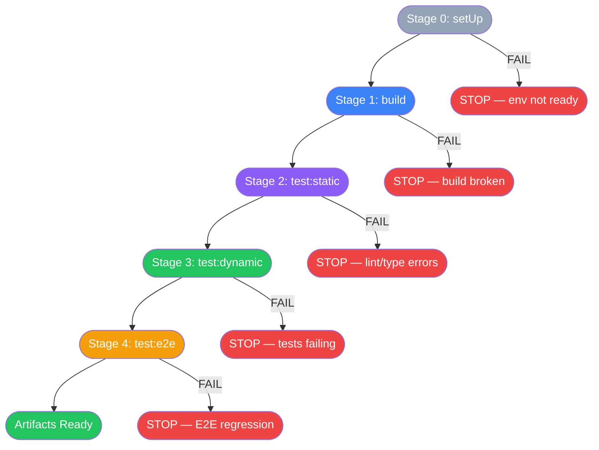
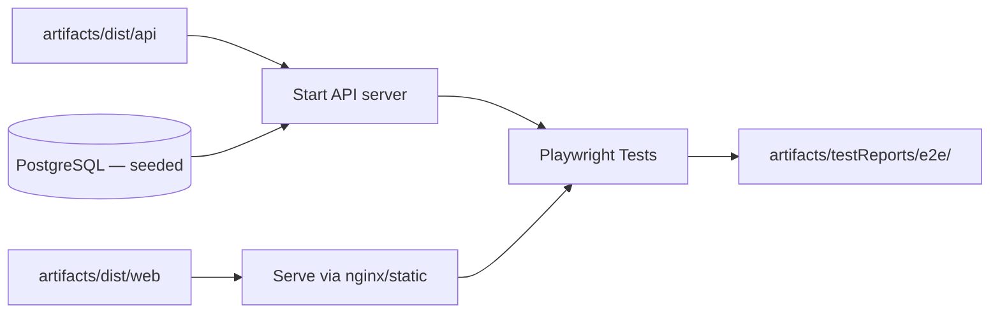

> [📚 INDEX](../INDEX.md) / [Architecture](../INDEX.md#architecture) / Build Pipeline

# Build Pipeline Contract — TaskFlow

Deterministic, sequential, gated build process. Same in every environment — local, CI,
Docker, anywhere. No exceptions. This eliminates "works on my machine" by design.

## Table of Contents

- [1. Why This Exists](#1-why-this-exists)
- [2. Pipeline Stages](#2-pipeline-stages)
- [3. Artifacts System](#3-artifacts-system)
- [4. Stage Definitions](#4-stage-definitions)
- [5. Environment Parity](#5-environment-parity)

## 1. Why This Exists

**Predictability.** Every environment runs the exact same stages in the exact same order
with the exact same gates. A build that passes locally passes in CI. A build that fails
in CI fails locally. There is no ambiguity about what "it works" means — it means all
5 stages passed and all artifacts were produced.

## 2. Pipeline Stages



**Rule: each stage gates the next.** A failing stage stops the pipeline. No skipping.

## 3. Artifacts System

All build outputs go to `./artifacts/` (gitignored). This is the single source of truth
for what was produced by the pipeline.

```text
artifacts/
├── dist/
│   ├── api/                  # Published .NET API binary
│   └── web/                  # Angular production build (static files)
├── testReports/
│   ├── api/                  # Integration test results (xUnit XML/HTML)
│   └── e2e/                  # Playwright test results (HTML report + screenshots)
└── openApi/
    ├── open-api.json         # Auto-generated OpenAPI spec
    └── open-api.yaml         # Same spec, YAML format
```

| Artifact | Produced By | Consumed By |
| -------- | ----------- | ----------- |
| `dist/api` | Stage 1 (build) | Stage 4 (test:e2e) — API must be running |
| `dist/web` | Stage 1 (build) | Stage 4 (test:e2e) — frontend must be served |
| `testReports/api` | Stage 3 (test:dynamic) | CI reporting, code review |
| `testReports/e2e` | Stage 4 (test:e2e) | CI reporting, code review |
| `openApi/open-api.*` | Stage 1 (build) — auto-generated from controllers | API documentation, frontend client generation |

## 4. Stage Definitions

### Stage 0: setUp

**Purpose**: Prepare the environment. Nothing runs until this passes.

| Step | What | Gate |
| ---- | ---- | ---- |
| 0.1 | Validate env vars exist and are non-empty | Missing var → FAIL with name of missing var |
| 0.2 | `docker compose up -d db` — start PostgreSQL container | Container unhealthy after retries → FAIL |
| 0.3 | Verify DB connection (`SELECT 1`) with retry (3x, 2s interval) | Cannot connect → FAIL |
| 0.4 | Run migrations (`dotnet ef database update`) | Migration error → FAIL |
| 0.5 | Run seeders (idempotent, always executes) | Seeder error → FAIL |

### Stage 1: build

**Purpose**: Compile and bundle everything. Produce distributable artifacts.

| Step | What | Gate |
| ---- | ---- | ---- |
| 1.1 | `dotnet build` — compile .NET solution | Compile error → FAIL |
| 1.2 | `dotnet publish -o artifacts/dist/api` — publish API binary | Publish error → FAIL |
| 1.3 | `pnpm install --frozen-lockfile` — install frontend deps (exact versions) | Install error → FAIL |
| 1.4 | `pnpm build` — build Angular app to `artifacts/dist/web` | Build error → FAIL |
| 1.5 | Generate OpenAPI spec to `artifacts/openApi/` | Generation error → FAIL |

### Stage 2: test:static

**Purpose**: Code quality gates. No execution, just analysis.

| Step | What | Gate |
| ---- | ---- | ---- |
| 2.1 | `dotnet format --verify-no-changes` — C# formatting | Format violations → FAIL |
| 2.2 | `pnpm lint` — ESLint + Prettier on frontend | Lint errors → FAIL |
| 2.3 | `pnpm type-check` — TypeScript strict type checking | Type errors → FAIL |

### Stage 3: test:dynamic

**Purpose**: Run integration tests against real database. Primary confidence layer.

| Step | What | Gate |
| ---- | ---- | ---- |
| 3.1 | `dotnet test` — integration tests via WebApplicationFactory + PostgreSQL | Any test fails → FAIL |
| 3.2 | Collect test reports to `artifacts/testReports/api/` | Report generation error → FAIL |

Tests run against the PostgreSQL container started in Stage 0. Same engine, same
migrations, same constraints as production.

### Stage 4: test:e2e

**Purpose**: End-to-end regression through real browser. Consumes artifacts from BOTH
api and web builds.



| Step | What | Gate |
| ---- | ---- | ---- |
| 4.1 | Start API from `artifacts/dist/api` against seeded PostgreSQL | API not healthy → FAIL |
| 4.2 | Serve frontend from `artifacts/dist/web` | Frontend not serving → FAIL |
| 4.3 | `pnpm test:e2e` — Playwright against real browser | Any test fails → FAIL |
| 4.4 | Collect reports + screenshots to `artifacts/testReports/e2e/` | Report error → FAIL |

**Key insight**: E2E tests do NOT build anything. They consume the artifacts already
produced by Stage 1. This ensures we test exactly what ships.

## 5. Environment Parity

| Aspect | Local | CI | Docker |
| ------ | ----- | -- | ------ |
| PostgreSQL version | Same container image | Same container image | Same container image |
| .NET SDK version | Exact (pinned in `global.json`) | Same (from Docker image) | Same (from Dockerfile) |
| Node/pnpm version | Exact (pinned in `package.json` engines) | Same (from Docker image) | Same (from Dockerfile) |
| Env vars | `.env` file | CI secrets → same var names | `.env` file |
| Pipeline stages | 0 → 1 → 2 → 3 → 4 | 0 → 1 → 2 → 3 → 4 | 0 → 1 → 2 → 3 → 4 |
| Artifacts path | `./artifacts/` | `./artifacts/` | `./artifacts/` |

**Same stages. Same order. Same gates. Same artifacts. Every time. Everywhere.**

## Related Documents

- [EP00 — Project Infrastructure](../epics/EP00-project-infrastructure.md) — parent epic
- [Tech Stack — Decision 7: Docker Strategy](tech-stack.md#decision-7-docker-strategy) — rationale
  for the multi-stage Docker build this pipeline targets
- [Testing Strategy](testing-strategy.md) — test suites executed in Stage 2 and Stage 3
- [US-012 — Docker Multi-Stage Build](../user-stories/US-012-docker-multi-stage-build.md) —
  Dockerfile implementation of Stages 0–1
- [US-013 — Docker Compose Environment](../user-stories/US-013-docker-compose-environment.md) —
  Compose orchestration of the images this pipeline produces
