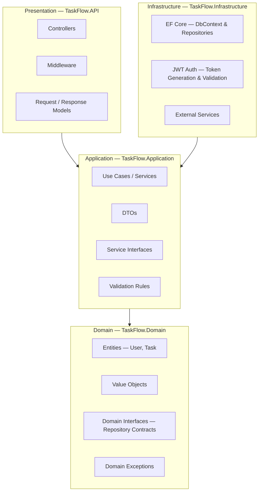
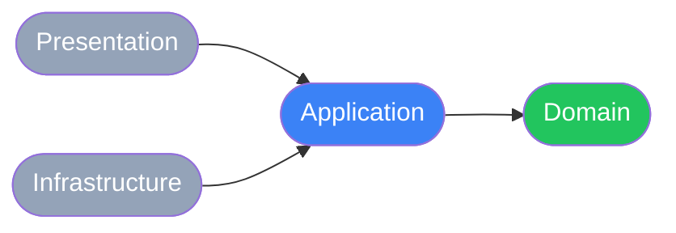
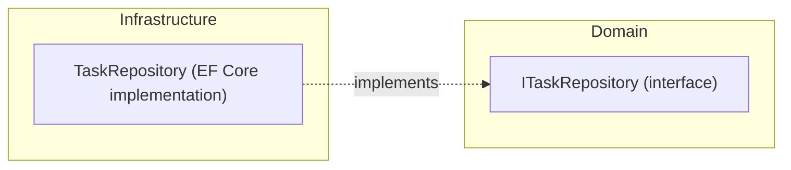
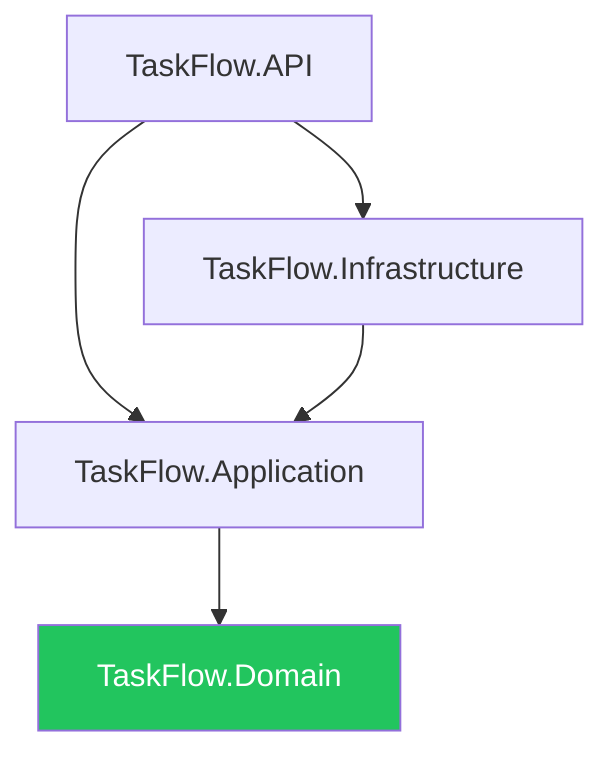
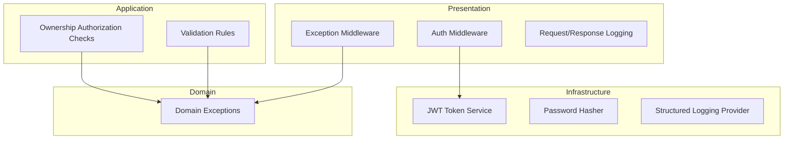
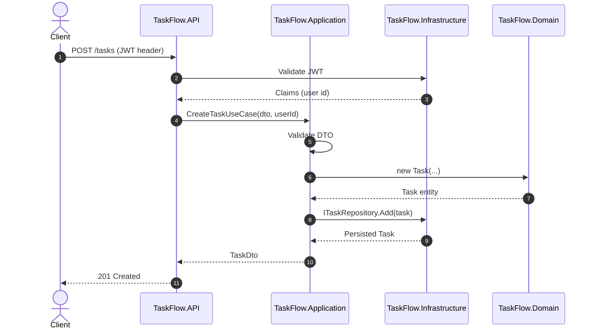

> [📚 INDEX](../INDEX.md) / [Architecture](../INDEX.md#architecture) / Clean Architecture

# Clean Architecture — TaskFlow

Architectural blueprint for the TaskFlow API. Defines the layers, the dependency
rule, the solution structure, and where each concept lives. No implementation
code — this is a map, not a manual.

## Table of Contents

- [1. Layer Diagram](#1-layer-diagram)
- [2. Dependency Rule](#2-dependency-rule)
- [3. Project Structure](#3-project-structure)
- [4. Project References](#4-project-references)
- [5. What Goes Where](#5-what-goes-where)
- [6. Cross-Cutting Concerns](#6-cross-cutting-concerns)
- [7. Request Flow Example](#7-request-flow-example)

## 1. Layer Diagram

Four concentric layers. The Domain sits at the center with zero external
dependencies; every other layer wraps around it.



## 2. Dependency Rule

Source code dependencies point inward only. The Domain layer knows nothing
about Application, Infrastructure, or Presentation. Outer layers depend on
inner layers — never the reverse.



Infrastructure implements interfaces declared in the inner layers (Domain and
Application) rather than the inner layers reaching outward. This is the
Dependency Inversion Principle applied at the architecture level.



## 3. Project Structure

Standard .NET solution layout. Each project maps to one architectural layer.
Testing follows a hybrid model: fast unit test projects for Domain and
Application (mocked dependencies via NSubstitute), an integration test
project exercising the full API against a real PostgreSQL database, and a
Playwright E2E suite for whole-system regression.

```text
TaskFlow.sln
├── src/
│   ├── TaskFlow.Domain/
│   │   ├── Entities/            # User, Task
│   │   ├── Enums/               # TaskStatus
│   │   ├── ValueObjects/        # Email, PasswordHash
│   │   ├── Interfaces/          # IUserRepository, ITaskRepository
│   │   └── Exceptions/          # DomainException hierarchy
│   │
│   ├── TaskFlow.Application/
│   │   ├── UseCases/
│   │   │   ├── Tasks/           # CreateTask, UpdateTask, CompleteTask, ...
│   │   │   └── Users/           # RegisterUser, AuthenticateUser
│   │   ├── DTOs/                # TaskDto, UserDto, CreateTaskRequest
│   │   ├── Interfaces/          # ITokenService, IPasswordHasher
│   │   ├── Validation/          # FluentValidation rule sets
│   │   └── Mappings/            # DTO <-> Entity mapping profiles
│   │
│   ├── TaskFlow.Infrastructure/
│   │   ├── Persistence/
│   │   │   ├── TaskFlowDbContext.cs
│   │   │   ├── Configurations/  # EF entity type configurations
│   │   │   ├── Repositories/    # UserRepository, TaskRepository
│   │   │   └── Migrations/
│   │   ├── Auth/                # JwtTokenService, PasswordHasher
│   │   └── ExternalServices/    # third-party integrations, if any
│   │
│   └── TaskFlow.API/
│       ├── Controllers/         # TasksController, AuthController
│       ├── Middleware/          # ExceptionHandling, JwtAuthentication
│       ├── Models/              # request/response contracts (API-facing)
│       ├── Filters/             # action filters
│       └── Program.cs           # composition root, DI registration
│
└── tests/
    ├── TaskFlow.Domain.Tests/        # Unit tests — Domain entities, value objects, invariants
    ├── TaskFlow.Application.Tests/   # Unit tests — use cases with NSubstitute-mocked repositories
    ├── TaskFlow.IntegrationTests/    # API-level integration tests (WebApplicationFactory)
    └── TaskFlow.E2E/                 # Playwright E2E regression tests
```

## 4. Project References

Reference direction mirrors the dependency rule: a project may only reference
projects closer to the Domain.



`TaskFlow.API` references `Infrastructure` only to wire up dependency
injection in `Program.cs` — controllers themselves depend on `Application`
interfaces, not on `Infrastructure` implementations directly.

## 5. What Goes Where

| Concept | Layer | Example |
| --- | --- | --- |
| Business entities | Domain | `User`, `Task` |
| Enums tied to domain rules | Domain | `TaskStatus` (Pending / InProgress / Completed) |
| Domain invariants | Domain | A task without an owner cannot exist |
| Repository contracts | Domain | `IUserRepository`, `ITaskRepository` |
| Domain-specific exceptions | Domain | `TaskNotFoundException`, `UnauthorizedTaskAccessException` |
| Use case orchestration | Application | `CreateTaskUseCase`, `CompleteTaskUseCase` |
| DTOs / request-response shapes | Application | `TaskDto`, `CreateTaskRequest` |
| Input validation rules | Application | "title is required", "email must be valid" |
| Service interfaces implemented outward | Application | `ITokenService`, `IPasswordHasher` |
| Authorization policy ("is this my task?") | Application | ownership check inside use case |
| EF Core `DbContext` and configurations | Infrastructure | `TaskFlowDbContext` |
| Repository implementations | Infrastructure | `EfTaskRepository` |
| JWT issuing and validation logic | Infrastructure | `JwtTokenService` |
| Password hashing implementation | Infrastructure | BCrypt/Argon2 adapter |
| Database migrations | Infrastructure | EF Core migration files |
| HTTP endpoints | Presentation (API) | `TasksController`, `AuthController` |
| Request/response wire models | Presentation (API) | JSON contracts exposed to clients |
| Global exception-to-HTTP mapping | Presentation (API) | exception-handling middleware |
| Route-level auth enforcement | Presentation (API) | `[Authorize]` attribute usage |

## 6. Cross-Cutting Concerns



| Concern | Primary Home | Notes |
| --- | --- | --- |
| Authentication (JWT) | Infrastructure issues/validates tokens; Presentation enforces via middleware | `TaskFlow.Infrastructure/Auth` + `[Authorize]` in `TaskFlow.API` |
| Authorization (ownership) | Application | Use cases check `Task.OwnerId == currentUserId` before acting |
| Validation | Application | Rule sets validate DTOs before a use case executes |
| Error handling | Domain defines exception types; Presentation maps them to HTTP status codes | Global exception middleware translates `DomainException` to 4xx/5xx |
| Logging | Infrastructure provides the logging implementation; called from any layer via an abstraction | Structured logs correlate request ID across layers |

## 7. Request Flow Example

Illustrates how a single request crosses all four layers, respecting the
dependency rule at every step.



This flow implements [US-004 — Create Task](../user-stories/US-004-create-task.md); the same
layering applies to every endpoint in the [API Contract](api-contract.md).

## Related Documents

- [Tech Stack](tech-stack.md) — technology choices that implement these layers
- [API Contract](api-contract.md) — endpoints exposed by the Presentation layer
- [Testing Strategy](testing-strategy.md) — how each layer is exercised by integration tests
