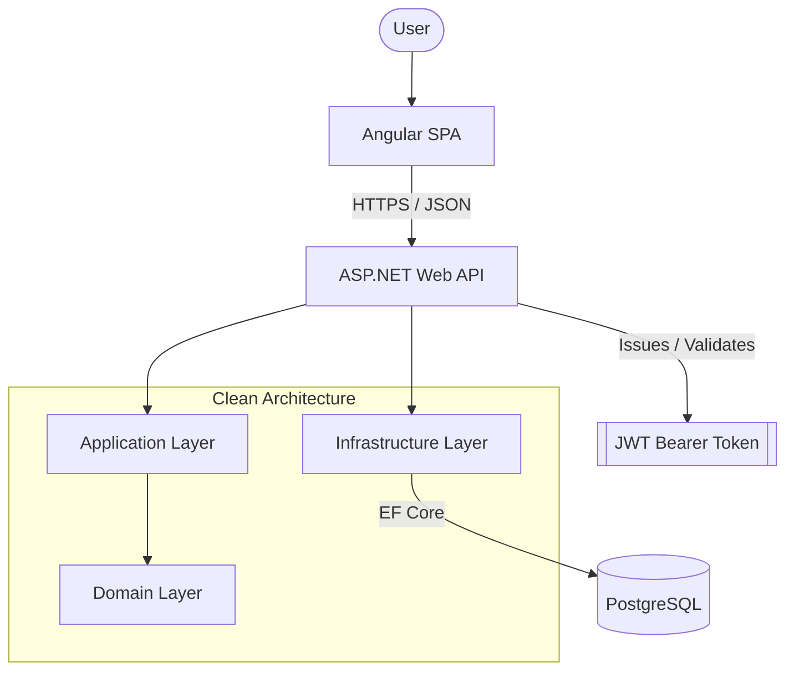
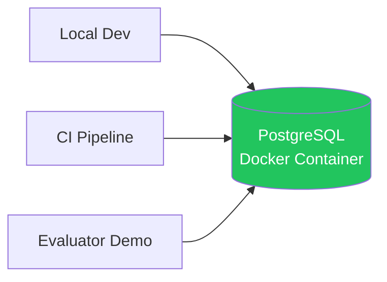
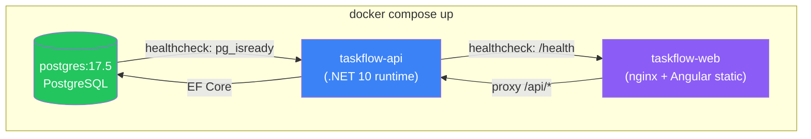
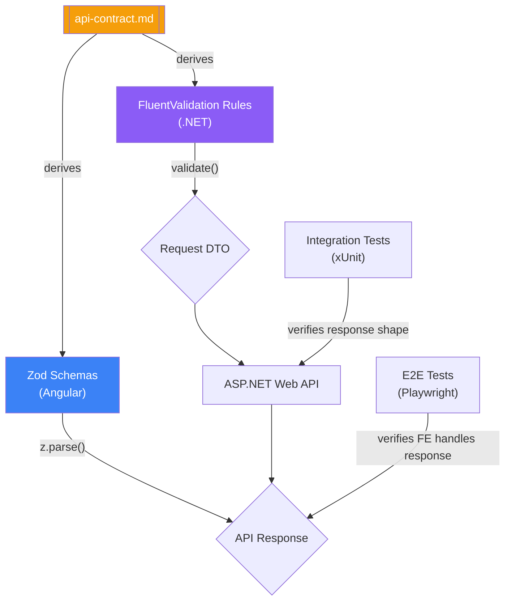

> [📚 INDEX](../INDEX.md) / [Architecture](../INDEX.md#architecture) / Tech Stack

# Tech Stack — TaskFlow

> **Pinned versions**: the canonical version for every dependency lives in
> [README — Version Manifest](../../README.md#version-manifest). Versions in this document
> are illustrative; the manifest is the source of truth.

## Table of Contents

- [Purpose](#purpose)
- [Stack Overview](#stack-overview)
- [Decision 1: .NET Version](#decision-1-net-version)
- [Decision 2: Database Engine](#decision-2-database-engine)
- [Decision 3: ORM / Data Access](#decision-3-orm--data-access)
- [Decision 4: Authentication Mechanism](#decision-4-authentication-mechanism)
- [Decision 5: Frontend Framework](#decision-5-frontend-framework)
- [Decision 6: Testing Strategy](#decision-6-testing-strategy)
- [Decision 7: Docker Strategy](#decision-7-docker-strategy)
- [Decision 8: Dependency Version Pinning](#decision-8-dependency-version-pinning)
- [Contract Validation](#contract-validation)
- [Summary Table](#summary-table)

## Purpose

This document records the technology decisions for TaskFlow and the reasoning behind each one.
The challenge mandates ASP.NET Web API, Clean Architecture, and TDD. Every other choice below
optimizes for one evaluation constraint: an interviewer must clone the repository and run the
full system with minimal friction. See the [Project Brief](../project-brief.md) for the
constraints and evaluation criteria that drive these decisions.

## Stack Overview

## Decision 1: .NET Version

- [x] .NET 10 (latest LTS)
- [ ] .NET 8 (previous LTS)
- [ ] .NET 9 (STS)

**Why**: .NET 10 is the current Long-Term Support release and is the version verified installed on
the development machine (`dotnet --version` → `10.0.301`). Building against the SDK actually present
removes any chance of a version mismatch during setup or evaluation.

**Tradeoffs**: We give up the larger body of existing StackOverflow/blog content that accumulates
around older LTS releases like .NET 8. We gain the latest runtime and language improvements plus
guaranteed alignment between the documented stack and the environment the project is actually built
and run in — no "works on my machine but not the SDK I have" risk.

## Decision 2: Database Engine

- [x] PostgreSQL (containerized via Docker Compose)
- [ ] SQLite (file-based)
- [ ] SQL Server (LocalDB or full instance)

**Why**: PostgreSQL is the same engine in every environment — local development, CI, and the Docker
Compose demo the evaluator runs. There is no "in-memory vs. real DB" mismatch: migrations, foreign
key constraints, index behavior, and transaction semantics are identical everywhere. Docker Compose
starts the PostgreSQL container automatically, so the evaluator still runs a single
`docker compose up` and gets a fully seeded, working system with zero local database installation.

**Tradeoffs**: We give up the zero-service simplicity of SQLite (no container needed, no connection
string). We gain full fidelity: tests exercise the exact same SQL engine that production uses,
eliminating the class of bugs where SQLite's looser type system and constraint handling silently
diverge from a real RDBMS. Since Docker Compose already manages the API and frontend containers,
adding a PostgreSQL container introduces no new complexity for the evaluator.

## Decision 3: ORM / Data Access

- [x] Entity Framework Core
- [ ] Dapper
- [ ] ADO.NET (raw)

**Why**: EF Core is the standard data-access technology for ASP.NET and fits Clean Architecture
naturally: the infrastructure layer implements repository interfaces defined in the domain, and EF
Core handles mapping, migrations, and change tracking behind that boundary. Code-first migrations
also double as the seeding mechanism the challenge requires.

**Tradeoffs**: We give up the raw performance and SQL-level control that Dapper or ADO.NET offer.
We gain significantly faster development, built-in migration tooling, and less boilerplate — a
better tradeoff for a system of this size and for an exercise judged on architecture clarity over
query-level optimization.

## Decision 4: Authentication Mechanism

- [x] JWT Bearer tokens
- [ ] Cookie-based sessions
- [ ] Server-side session state

**Why**: The frontend and backend are separate applications communicating over HTTP, which is the
textbook case for token-based auth. JWT is stateless — no server-side session store is needed,
which keeps the backend simple and horizontally stateless. ASP.NET has first-class middleware
support for JWT bearer validation, and the token's claims naturally carry the authenticated user's
identity into every "user can only access their own tasks" check. Maps to
[US-003 — Protected Access](../user-stories/US-003-protected-access.md).

**Tradeoffs**: We give up the built-in CSRF protection and automatic expiry handling that
cookie-based sessions provide, and take on responsibility for token storage on the client and
expiration/refresh handling. We gain a decoupled frontend/backend that can be hosted, scaled, or
swapped independently, and a mechanism that is the de facto standard for SPA-to-API auth.

## Decision 5: Frontend Framework

- [x] Angular
- [ ] React

**Why**: The candidate has deeper hands-on expertise in Angular. The CLI scaffolds a
production-ready project with routing, SCSS, and a clean module structure out of the box. Adding
Vitest, Tailwind, ESLint, Prettier, and pnpm on top of the scaffold produces a fully-wired setup
that removes an entire category of tooling risk under a fixed deadline and lets effort go toward
the actual CRUD features and Clean Architecture on the backend, which is what the exercise
evaluates.

**Tradeoffs**: We give up React's smaller footprint and more minimal ceremony for a CRUD-scoped
app. We gain Angular's opinionated, batteries-included structure (DI, routing, forms, HTTP client)
and a well-defined scaffold workflow instead of assembling an equivalent toolchain for React from
zero.

## Decision 6: Testing Strategy

| Layer    | Decision                                                          | Alternatives Considered                           |
|----------|--------------------------------------------------------------------|---------------------------------------------------|
| Backend  | Unit tests (xUnit + NSubstitute) + integration tests at the API level (xUnit) | Unit tests only, no integration layer   |
| Frontend | Playwright E2E regression tests                                  | Vitest + Angular Testing Library (component/unit) |

- [x] xUnit integration tests against the API surface (real PostgreSQL test container DB) — PRIMARY confidence layer
- [x] xUnit unit tests for Domain + Application layers with NSubstitute-mocked dependencies — complementary, fast feedback
- [x] Playwright E2E tests
- [ ] Frontend unit/component tests

**Why**: For a CRUD-sized project, tests that exercise the API end-to-end (request in, DB state
out) catch more real defects per test than isolated unit tests mocking every collaborator, so
integration tests remain the PRIMARY confidence layer — they verify the Clean Architecture layers
actually compose correctly, not just that each layer satisfies its own interface in isolation. A
complementary unit layer (xUnit + NSubstitute) covers Domain invariants and Application use case
logic in isolation — fast, mocked, sub-second feedback while developing business logic, before an
integration test ever spins up a container. On the frontend, Playwright E2E tests against a real
running app and test DB container validate the user-facing CRUD flows directly, which matters more
for this scope than component-level rendering assertions. TDD discipline (Red/Green/Refactor,
AAA — Arrange/Act/Assert) is followed at both levels: unit-level for Domain/Application classes,
and integration/E2E-level for acceptance criteria.

**Tradeoffs**: We give up some of the isolation-only speed advantage by also maintaining a slower
integration suite, and we give up full reliance on end-to-end tests by also maintaining unit test
coverage — two layers to keep green instead of one. We gain substantially higher confidence per
integration test written, since each proves the full path (controller → application → domain →
infrastructure → DB) actually works, while the unit layer catches Domain/Application logic errors
close to the source without waiting on a database. Full rationale and coverage mapping live in the
[Testing Strategy](testing-strategy.md#21-unit-tests-domain--application), Section 2.1.

## Decision 7: Docker Strategy

- [x] Multi-stage Dockerfile (build → test → runtime) + Docker Compose for local dev/demo
- [ ] Single-stage Dockerfile
- [ ] No containerization (bare `dotnet run` / local Node tooling only)

**Why**: A multi-stage build separates the full SDK (build and test stages) from the final runtime
image (minimal ASP.NET runtime, no SDK), keeping the shipped image small while still running tests
as part of the build. Docker Compose wires the API, frontend, and any test DB container together so
an interviewer runs a single `docker compose up` and gets a fully working system with zero local SDK,
Node, or database installation required.

**Tradeoffs**: We give up the marginally faster inner-loop iteration of running the API directly on
the host with `dotnet watch`. We gain a reproducible, isolated environment that eliminates "missing
SDK/Node version" failures entirely and matches how the system would realistically be deployed.

### Docker Compose Topology — 3 Containers

| Container | Base Image | Role |
| --------- | ---------- | ---- |
| `postgres` | `postgres:17.5` (exact tag, pinned) | Database — migrations run on startup, seed data loaded |
| `taskflow-api` | Multi-stage: SDK build → ASP.NET runtime | Backend API — connects to `postgres` via env vars |
| `taskflow-web` | Multi-stage: Node build → nginx | Frontend — serves Angular static build, proxies `/api/*` to `taskflow-api` |

**Startup order**: `postgres` starts first (healthcheck: `pg_isready`), `taskflow-api` waits for
postgres healthy, `taskflow-web` waits for api healthy. All three env vars come from `.env` file
at the Compose root. See [Build Pipeline — Stage 0](build-pipeline.md#stage-0-setup) for the
fail-fast env var validation.

## Decision 8: Dependency Version Pinning

- [x] Exact versions for all dependencies (NuGet, npm/pnpm, Docker base images)
- [ ] Caret/tilde ranges (`^`, `~`)
- [ ] `latest` tags

**Why**: A demo/evaluation project must produce an identical build regardless of when it's cloned.
Exact versions across `.csproj`, `package.json`, and Dockerfile base images guarantee that a clone
six months from now resolves the exact same dependency graph the project was built and tested
against.

**Tradeoffs**: We give up automatic minor/patch security and bugfix updates — upgrades become a
deliberate, manual action instead of happening silently on next install. We gain full reproducibility
and eliminate an entire failure class where a floating version resolves to a newer, incompatible
release right before or during evaluation.

## Contract Validation

`docs/architecture/api-contract.md` describes the API surface in prose and JSON examples, but prose
drifts silently from implementation unless something enforces it at build/test time. Both sides of
the stack validate against the contract with a dedicated library, so a broken contract fails a build
or a test instead of surfacing as a runtime bug in front of the evaluator.

### Frontend — Zod

- [x] Zod for runtime response validation
- [ ] No runtime validation (rely on TypeScript types only)
- [ ] Manual `if` guards per response shape

**Purpose**: every Angular HTTP service method pipes its response through `z.parse()` against a
schema derived from `api-contract.md`. A schema mismatch throws immediately in development and is
caught by tests before it ships — the contract stops being documentation and becomes an executable
gate.

**Why Zod**: TypeScript-first — schemas infer their static types via `z.infer<typeof schema>`, so
the schema is the single source of truth for both runtime validation and compile-time types. There
is no second, hand-maintained `interface` that can drift from the validation logic.

**Tradeoffs**: We give up the zero-runtime-cost of relying on TypeScript types alone, which are
erased at compile time and cannot catch a backend that silently changes a response shape. We gain a
runtime safety net that turns contract drift into an immediate, loud failure instead of an
`undefined` bug discovered downstream in a component template.

### API Specification — Microsoft.AspNetCore.OpenApi

- [x] `Microsoft.AspNetCore.OpenApi` (built-in, .NET 9+)
- [ ] Swashbuckle (`Swashbuckle.AspNetCore`)
- [ ] NSwag

**Purpose**: generates the OpenAPI specification for `TaskFlow.API` at build time, giving the
evaluator a machine-readable, always-in-sync view of the API surface alongside `api-contract.md`.

**Why Microsoft.AspNetCore.OpenApi**: built into the ASP.NET Core SDK since .NET 9, so it requires
no external NuGet dependency — one less package to pin, update, or audit. It ships as part of the
framework the project already targets (.NET 10), and covers the generation need without pulling in
a third-party library.

**Tradeoffs**: We give up Swashbuckle's built-in Swagger UI page and NSwag's client-code
generation, both of which would need to be added separately (or via a lightweight UI middleware) if
an interactive docs page is desired later. We gain zero added dependency surface for the core spec
generation, which is enough for `api-contract.md` cross-validation purposes.

### Backend — FluentValidation

- [x] FluentValidation for request DTO validation
- [ ] Data Annotations (`[Required]`, `[MaxLength]`, etc.)
- [ ] Manual validation in controllers/handlers

**Purpose**: every command/query DTO has a corresponding validator, and every request is validated
before it reaches the use case. Invalid requests are rejected at the edge of the Application layer,
so domain and application logic never has to defend against malformed input the contract already
rules out.

**Why FluentValidation**: the most mature validation library in the .NET ecosystem, with a fluent,
composable API (`RuleFor(x => x.Title).NotEmpty().MaximumLength(200)`) that is easy to unit test in
isolation from the ASP.NET pipeline. It integrates into the request pipeline via
`AddFluentValidation()`, so validators run automatically ahead of the controller action.

**Tradeoffs**: We give up the terser, attribute-on-property style of Data Annotations for a
slightly more verbose, separate validator class per DTO. We gain validators that are independently
unit-testable, support cross-property and async rules that Data Annotations cannot express, and keep
validation logic out of the DTOs themselves — consistent with keeping DTOs as plain data carriers.

### Bidirectional Contract Enforcement

**Why this closes the loop**: a change to `api-contract.md` that is not mirrored in the Zod schema
fails frontend tests (parse error on a fixture response). A change not mirrored in a
FluentValidation rule lets an invalid request reach a use case, which the backend integration tests
catch by asserting the API's actual accepted/rejected shapes against the documented contract. Neither
side can silently drift from the documented contract without a test failing.

## Summary Table

| Decision            | Chosen                              | Primary Driver                                               |
|---------------------|-------------------------------------|--------------------------------------------------------------|
| .NET version        | .NET 10 (latest LTS)                | Matches verified installed SDK                               |
| Database            | PostgreSQL (Docker)                 | Same engine everywhere — full fidelity, no mismatch          |
| ORM                 | Entity Framework Core               | Clean Architecture fit + migrations-as-seeding               |
| Auth                | JWT Bearer                          | Stateless SPA/API separation                                 |
| Frontend            | Angular                             | Candidate expertise + existing production-ready base project |
| Backend testing     | xUnit unit tests (NSubstitute) + xUnit integration tests (API-level) | Unit for fast Domain/Application feedback, integration as primary confidence layer |
| Frontend testing    | Playwright E2E                      | Validates real user flows over component internals           |
| Test DB isolation   | Respawn                             | Resets test DB state between runs — see [Testing Strategy](testing-strategy.md#32-test-database-strategy) |
| CI test containers  | Testcontainers.PostgreSql           | Ephemeral PostgreSQL container per CI run — see [Testing Strategy](testing-strategy.md#32-test-database-strategy) |
| API specification   | Microsoft.AspNetCore.OpenApi (built-in) | No external dependency, generates OpenAPI spec at build time |
| Containerization    | Multi-stage Docker + Compose        | One-command run, zero local SDK/Node/DB install              |
| Dependency versions | Exact pinning                       | Reproducible builds across time                              |
| FE contract validation | Zod                               | TypeScript-first, single source of truth for types + runtime |
| BE contract validation | FluentValidation                  | Mature, fluent, testable request DTO validation              |

## Related Documents

- [Clean Architecture](clean-architecture.md) — how these layers (Domain, Application, Infrastructure, Presentation) are structured
- [API Contract](api-contract.md) — endpoints implemented on top of this stack
- [Testing Strategy](testing-strategy.md) — full rationale for Decision 6
- [Project Brief](../project-brief.md) — constraints and evaluation criteria driving these decisions
