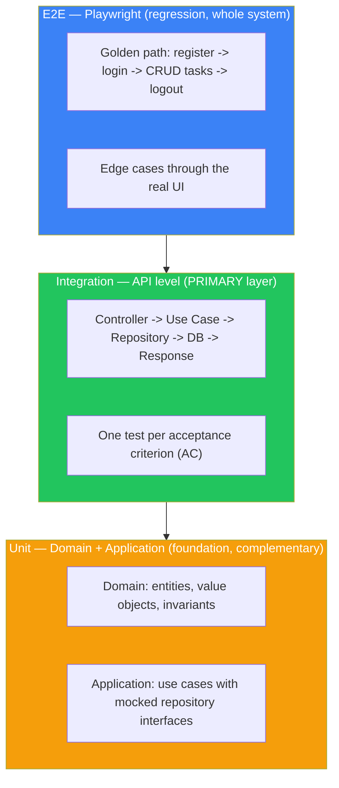
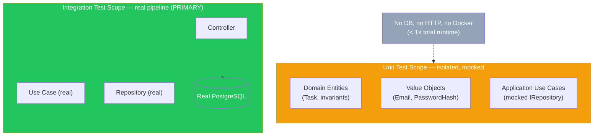
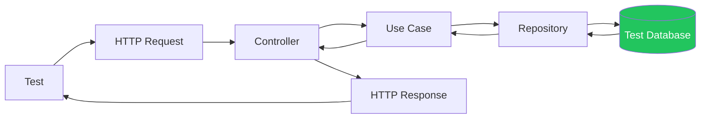
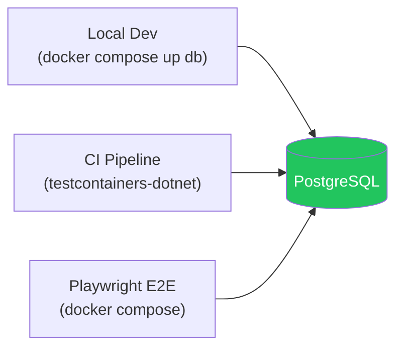
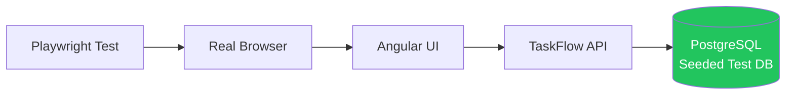
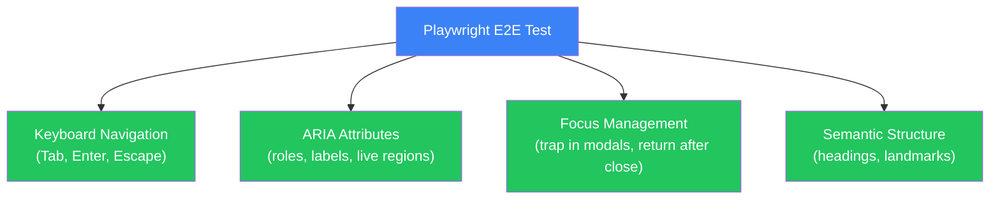
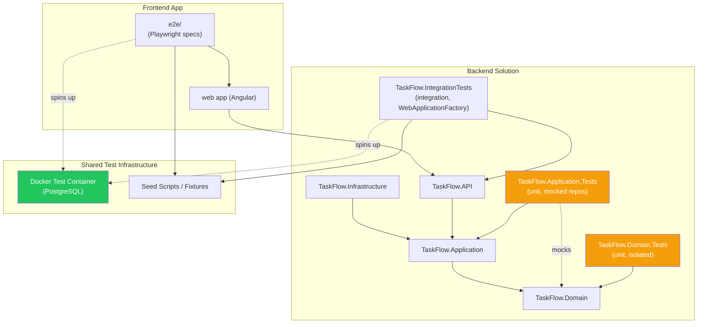
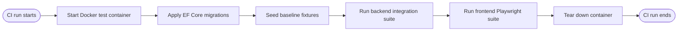
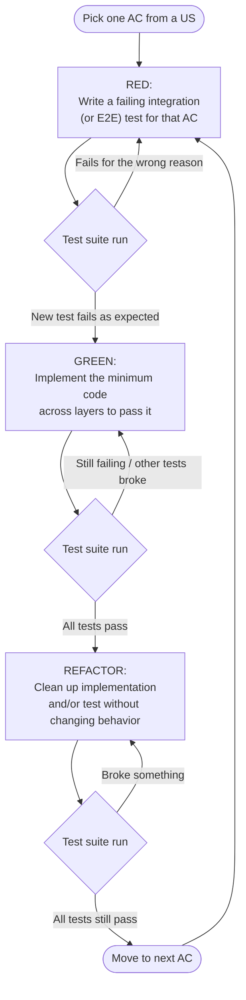

> [📚 INDEX](../INDEX.md) / [Architecture](../INDEX.md#architecture) / Testing Strategy

# Testing Strategy — TaskFlow

The testing constitution for TaskFlow. This document defines what gets tested, at what level,
with what tooling, and the non-negotiable rules every contributor — human or agent — must follow.
It is the harness that keeps the whole system safe to change.

## Table of Contents

- [1. Guiding Decisions](#1-guiding-decisions)
- [2. Testing Pyramid (Inverted)](#2-testing-pyramid-inverted)
  - [2.1 Unit Tests (Domain + Application)](#21-unit-tests-domain--application)
- [3. Backend Integration Tests](#3-backend-integration-tests)
- [4. Frontend E2E Tests (Playwright)](#4-frontend-e2e-tests-playwright)
  - [4.5 Accessibility (A11y) Testing](#45-accessibility-a11y-testing)
- [5. Test Architecture](#5-test-architecture)
- [6. TDD Workflow — Red, Green, Refactor at the Integration Level](#6-tdd-workflow--red-green-refactor-at-the-integration-level)
- [7. Test Naming Convention](#7-test-naming-convention)
- [8. Harness Rules](#8-harness-rules)

## 1. Guiding Decisions

These decisions are explicit and final for this project:

- **Unit tests cover Domain invariants and Application use case logic in isolation.** Domain
  entities, value objects, and use cases (with mocked repository interfaces) are fast, focused,
  and catch logic errors close to the source — before they ever reach a database or an HTTP
  pipeline.
- **Integration tests remain the PRIMARY confidence layer**, exercising the full request
  pipeline: controller → use case → repository → database → response. Most acceptance criteria
  are proven here, not in the unit layer.
- **Frontend confidence comes from Playwright E2E tests** driving a real browser against a real
  UI, a real API, and a seeded test database. No component tests.
- **TDD still applies** — Red/Green/Refactor — with the "unit" of TDD anchored at the integration
  or E2E level for acceptance criteria, and at the class/method level for Domain and Application
  logic covered by unit tests.
- **AAA (Arrange/Act/Assert)** structures every test, unit, integration, and frontend alike.
- **Tests are the harness.** Any agent or developer touching this codebase must treat the full
  test suite — unit, integration, and E2E — as the ground truth for "does it work," and must
  never leave any layer broken.

> **Data access layer coverage — explicit scope decision.** The challenge requires unit tests
> for "all components including the data access layer, business logic layer, and API
> endpoints." The data access layer (repository implementations) and API endpoints are
> covered by the integration test layer (real PostgreSQL, full pipeline) rather than
> dedicated unit test projects — this is a deliberate scope decision documented in
> [Tech Stack Decision 6](tech-stack.md#decision-6-testing-strategy). Domain invariants
> (business logic layer) and Application use cases have dedicated unit test projects with
> mocked repositories.

## 2. Testing Pyramid (Inverted)

Traditional pyramids put a large unit-test base under a thin integration/E2E top. TaskFlow keeps
that inversion for volume — integration is still the workhorse and E2E still provides
whole-system regression coverage — but the base is no longer empty. A fast unit layer covers
Domain invariants and Application use case logic in isolation, complementing (not replacing)
integration as the primary source of confidence.



| Layer | Volume | Role | Tooling |
| ----- | ------ | ---- | ------- |
| E2E | Small, curated | Whole-system regression, golden path + key edge cases | Playwright |
| Integration | Large, exhaustive | **Primary correctness layer**, one test per AC | xUnit/NUnit + WebApplicationFactory or Docker test container |
| Unit | Focused, fast | Complementary layer: Domain invariants + Application use case logic in isolation | xUnit/NUnit + mocked repository interfaces |

### 2.1 Unit Tests (Domain + Application)

Unit tests are the fast, isolated complement to integration tests. They do not touch a database,
an HTTP pipeline, or Docker — they exercise pure logic in the Domain and Application layers
directly, with dependencies (like repository interfaces) mocked or faked.

**What unit tests cover:**

- **Domain entities** — construction rules and invariants (e.g., a `Task` cannot be created with
  an empty title or a past due date).
- **Value Objects** — format and validation rules (e.g., `Email` format, `PasswordHash`
  construction).
- **Application use cases** — orchestration logic tested with mocked repository interfaces, so
  the test proves the use case's decision logic without needing a real database.

**What integration tests still cover (and remain PRIMARY for):** the full request pipeline —
controller, real EF Core mapping, real HTTP status codes, JWT middleware, ownership filtering
against a real PostgreSQL database. This is where acceptance criteria are ultimately proven.



**Example unit test names** (same `Action_Scenario_ExpectedResult` convention as
[Section 7](#7-test-naming-convention)):

Domain:

- [ ] `Task_CreateWithEmptyTitle_ThrowsDomainException`
- [ ] `Task_CreateWithPastDueDate_ThrowsDomainException`
- [ ] `TaskStatus_ParseInvalidValue_ThrowsArgumentException`
- [ ] `Email_CreateWithInvalidFormat_ThrowsValidationException`

Application:

- [ ] `CreateTaskUseCase_WithValidInput_ReturnsTaskDto`
- [ ] `CreateTaskUseCase_WithDuplicateTitle_DelegatesToRepository`
- [ ] `AuthenticateUserUseCase_WithWrongPassword_ThrowsUnauthorized`

**Speed constraint**: the entire unit suite runs in **under 1 second** — no database, no HTTP,
no Docker. This makes it the tightest feedback loop available while developing Domain and
Application logic, run continuously during local TDD before an integration test ever spins up a
container.

## 3. Backend Integration Tests

### 3.1 What they test

Every integration test drives the system from the outside in, through the real ASP.NET pipeline:



No layer is mocked except the boundary of the process itself (no external third-party services in
scope for TaskFlow today). Middleware (JWT auth, exception handling) executes for real.

### 3.2 Test database strategy

**One engine everywhere: PostgreSQL.** No in-memory provider, no SQLite stand-in. Every integration
test runs against a real PostgreSQL instance — the same engine, the same migrations, the same
constraints as production and the Docker Compose demo.



| Environment | How PostgreSQL runs | Lifecycle |
| ----------- | ------------------- | --------- |
| Local TDD | `docker compose up db` — developer starts it once, tests reuse it | Per test class: transaction rollback or DB reset |
| CI | `testcontainers-dotnet` — spins up a PostgreSQL container per test run | Container starts → migrate → seed → tests → tear down |
| Playwright E2E | Full `docker compose up` — same as evaluator demo | Seeded baseline, reset between suites |

**Why not EF InMemory or SQLite in-memory?** They skip real SQL semantics: foreign key constraints,
index behavior, type casting, and transaction isolation all differ. A test that passes against
InMemory but fails against PostgreSQL catches nothing — it just delays the failure to CI or worse,
to the evaluator's machine. One engine eliminates this entire failure class.

**Parallel test isolation**: each test class gets a fresh database (via `Respawn` or schema
recreation) to prevent cross-test contamination without sacrificing fidelity.

### 3.3 Mapping: Acceptance Criteria to Test Cases

Each user story's acceptance criteria (from [`api-contract.md`](api-contract.md)) becomes one
integration test. Naming follows `MethodName_Scenario_ExpectedResult` (see
[Section 7](#7-test-naming-convention)).

#### US-001 — User Registration (`POST /api/auth/register`)

Story: [US-001 — User Registration](../user-stories/US-001-user-registration.md)

- [ ] AC-1: `Register_WithInvalidEmailFormat_Returns400`
- [ ] AC-2: `Register_WithAlreadyRegisteredEmail_Returns409`
- [ ] AC-3: `Register_WithWeakPassword_Returns400`
- [ ] AC-4: `Register_WithMissingRequiredField_Returns400`
- [ ] Happy path: `Register_WithValidPayload_Returns201WithUserProfile`

#### US-002 — User Login (`POST /api/auth/login`)

Story: [US-002 — User Login](../user-stories/US-002-user-login.md)

- [ ] AC-2: `Login_WithWrongPassword_Returns401WithGenericMessage`
- [ ] AC-2: `Login_WithNonExistentEmail_Returns401WithSameGenericMessage`
- [ ] AC-3: `Login_WithMissingEmailOrPassword_Returns400`
- [ ] Happy path: `Login_WithValidCredentials_Returns200WithAccessToken`

#### US-003 — Protected Access (cross-cutting, all `/api/tasks/*`)

Story: [US-003 — Protected Access](../user-stories/US-003-protected-access.md)

- [ ] AC-1: `ProtectedEndpoint_WithValidToken_AllowsRequest`
- [ ] AC-2: `ProtectedEndpoint_WithMissingToken_Returns401`
- [ ] AC-3: `ProtectedEndpoint_WithExpiredOrTamperedToken_Returns401`
- [ ] AC-4: `ProtectedEndpoint_QueryOrMutation_IsScopedToOwnerIdClaim`

#### US-004 — Create Task (`POST /api/tasks`)

Story: [US-004 — Create Task](../user-stories/US-004-create-task.md)

- [ ] AC-3: `CreateTask_WithEmptyTitle_Returns400`
- [ ] AC-4: `CreateTask_WithPastDueDate_Returns400`
- [ ] AC-5: `CreateTask_IgnoresStatusInBody_AlwaysDefaultsToPending`
- [ ] Happy path: `CreateTask_WithValidPayload_Returns201WithOwnerIdSet`

#### US-005 — List Tasks (`GET /api/tasks`)

Story: [US-005 — List Tasks](../user-stories/US-005-list-tasks.md)

- [ ] AC-1: `ListTasks_WithNoFilter_ReturnsAllOwnStatuses`
- [ ] AC-2: `ListTasks_WhenUserHasNoTasks_ReturnsEmptyItemsNotError`
- [ ] AC-3: `ListTasks_OnlyReturnsTasksOwnedByCaller`
- [ ] AC-4: `ListTasks_EachItem_ExposesTitleStatusAndDueDate`

#### US-006 — View Task Detail (`GET /api/tasks/{id}`)

Story: [US-006 — View Task Detail](../user-stories/US-006-view-task-detail.md)

- [ ] AC-1: `GetTaskById_WithOwnedTask_Returns200WithFullDetail`
- [ ] AC-2: `GetTaskById_WithNonExistentId_Returns404`
- [ ] AC-3: `GetTaskById_OwnedByAnotherUser_Returns404NotForbidden`

#### US-007 — Update Task (`PATCH /api/tasks/{id}`)

Story: [US-007 — Update Task](../user-stories/US-007-update-task.md)

- [ ] AC-4: `UpdateTask_WithInvalidStatusEnumValue_Returns400`
- [ ] AC-5: `UpdateTask_OwnedByAnotherUser_Returns404`
- [ ] AC-6: `UpdateTask_WithEmptyTitleString_Returns400`
- [ ] Happy path: `UpdateTask_WithPartialValidPayload_Returns200WithUpdatedFields`

#### US-008 — Delete Task (`DELETE /api/tasks/{id}`)

Story: [US-008 — Delete Task](../user-stories/US-008-delete-task.md)

- [ ] AC-2: `DeleteTask_WithNonExistentId_Returns404`
- [ ] AC-3: `DeleteTask_OwnedByAnotherUser_Returns404`
- [ ] AC-4: `DeleteTask_CalledTwice_SecondCallReturns404NotServerError`
- [ ] Happy path: `DeleteTask_WithOwnedTask_Returns204AndRemovesRecord`

#### US-009 — Filter Tasks by Status (`GET /api/tasks?status=`)

Story: [US-009 — Filter Tasks by Status](../user-stories/US-009-filter-tasks-by-status.md)

- [ ] AC-2: `ListTasks_FilterWithNoMatches_ReturnsEmptyItemsNotError`
- [ ] AC-3: `ListTasks_FilterWithInvalidEnumValue_Returns400ValidationError`
- [ ] AC-4: `ListTasks_FilterOmitted_ReturnsAllStatuses`
- [ ] Happy path: `ListTasks_FilterByValidStatus_ReturnsOnlyMatchingOwnTasks`

#### US-012 — Docker Multi-Stage Build

Story: [US-012 — Docker Multi-Stage Build](../user-stories/US-012-docker-multi-stage-build.md)

- [ ] AC-3/AC-4: `DockerBuild_BackendImage_ContainsOnlyRuntime`
- [ ] AC-4: `DockerBuild_BackendImage_ExcludesSDKAndSource`
- [ ] AC-2: `DockerBuild_TestStageFailure_PreventsRuntimeImage`
- [ ] AC-6: `HealthEndpoint_ReturnsOk_WhenApiAndDbAreRunning`
- [ ] AC-6: `HealthEndpoint_ReturnsDbDown_WhenPostgresUnreachable`

#### US-013 — Docker Compose Environment

Story: [US-013 — Docker Compose Environment](../user-stories/US-013-docker-compose-environment.md)

- [ ] AC-1: `DockerCompose_AllContainersStart_WhenEnvVarsValid`
- [ ] AC-6: `DockerCompose_ApiFailsFast_WhenEnvVarMissing`
- [ ] AC-2: `DockerCompose_NginxProxiesApi_ForApiRoutes`
- [ ] AC-7: `DockerCompose_NginxServesIndex_ForSpaRoutes`
- [ ] AC-4: `DockerCompose_PostgresHealthcheck_BlocksDependents`

#### US-014 — Test Infrastructure

Story: [US-014 — Test Infrastructure](../user-stories/US-014-test-infrastructure.md)

- [ ] AC-1: `TestInfra_IntegrationTests_UseRealPostgres`
- [ ] AC-4: `TestInfra_DatabaseReset_BetweenTests`
- [ ] AC-6: `TestInfra_DomainTests_ProjectCompiles`
- [ ] AC-6: `TestInfra_ApplicationTests_ProjectCompiles`
- [ ] AC-3: `TestInfra_PlaywrightSetup_CanLaunchBrowser`

#### US-015 — Seed Data and Demo Credentials

Story: [US-015 — Seed Data and Demo Credentials](../user-stories/US-015-seed-data-and-credentials.md)

- [ ] AC-1: `SeedData_DemoUser_ExistsAfterStartup`
- [ ] AC-2: `SeedData_DemoTasks_ExistForDemoUser`
- [ ] AC-4: `SeedData_Idempotent_RunsTwiceWithoutDuplicates`
- [ ] AC-5: `SeedData_Credentials_MatchDocumented`

## 4. Frontend E2E Tests (Playwright)

### 4.1 What they test

Real browser, real UI, real API, real (seeded) test database. No component is mocked or stubbed —
Playwright drives the application exactly as a user would.



### 4.2 Test database strategy

- A dedicated Docker container running the same database engine as production.
- Seeded with a known baseline (one or more test user accounts, a small set of pre-existing
  tasks) before the suite runs, so tests have deterministic starting state.
- Reset (or re-seeded) between test runs — not necessarily between every single test — to keep
  suite runtime reasonable while avoiding cross-test pollution for stateful scenarios (e.g., a
  delete test should not remove a task another test depends on; use test-scoped fixtures/tags).

### 4.3 CRUD coverage through the real UI

- [ ] `CreateTask_FromUI_AppearsInTaskList`
- [ ] `CreateTask_WithEmptyTitle_ShowsValidationErrorInUI`
- [ ] `ViewTaskDetail_FromList_ShowsFullTaskInfo`
- [ ] `UpdateTask_ChangeStatusFromUI_ReflectsInListImmediately`
- [ ] `DeleteTask_FromUI_RemovesFromListAndConfirms`
- [ ] `FilterTasksByStatus_FromUI_ShowsOnlyMatchingTasks`
- [ ] `FilterTasksByStatus_NoMatches_ShowsEmptyState`

### 4.4 Auth flow coverage

- [ ] `Register_NewUser_RedirectsToLoginOrDashboard`
- [ ] `Register_DuplicateEmail_ShowsConflictErrorInUI`
- [ ] `Login_ValidCredentials_RedirectsToTaskDashboard`
- [ ] `Login_InvalidCredentials_ShowsGenericErrorMessage`
- [ ] `AccessProtectedPage_WithoutSession_RedirectsToLogin`
- [ ] `AccessProtectedPage_WithExpiredSession_RedirectsToLoginWithMessage`
- [ ] `Logout_ClearsSessionAndBlocksProtectedRoutes`

### 4.5 Accessibility (A11y) Testing

Every E2E test also validates that the UI is usable without a mouse. This is not a separate test
suite — it is woven into the existing Playwright specs.



| A11y Dimension | What Playwright Checks | Example |
| -------------- | ---------------------- | ------- |
| Keyboard-only navigation | All interactive elements reachable via Tab, activatable via Enter/Space | Tab through form fields → Enter to submit → focus moves to success message |
| ARIA roles and labels | `role`, `aria-label`, `aria-describedby` present on interactive elements | Task list uses `role="list"`, each task `role="listitem"`, delete button has `aria-label="Delete task: {title}"` |
| Focus management | Focus trapped inside modals, returned to trigger on close | Open delete confirmation → Tab cycles within modal → Escape closes → focus returns to delete button |
| Live regions | Status changes announced to screen readers | Task status update → `aria-live="polite"` region announces "Task updated to In Progress" |
| Form validation | Error messages associated with inputs via `aria-describedby` | Invalid email → error `id="email-error"` → input has `aria-describedby="email-error"` |

**A11y test naming**: same convention — `Action_A11y_ExpectedResult`:
- [ ] `Navigation_TabThroughMainLayout_AllInteractiveElementsReachable`
- [ ] `CreateTaskForm_KeyboardOnlySubmission_SubmitsAndFocusesResult`
- [ ] `DeleteConfirmation_FocusTrap_CyclesWithinModal`
- [ ] `DeleteConfirmation_EscapeKey_ClosesAndReturnsFocus`
- [ ] `TaskStatusUpdate_AriaLiveRegion_AnnouncesChange`
- [ ] `FormValidation_InvalidInput_ErrorLinkedViaAriaDescribedby`
- [ ] `LoginForm_TabOrder_FollowsVisualOrder`

### 4.6 Golden path (single end-to-end regression scenario)

- [ ] `GoldenPath_RegisterLoginCreateFilterUpdateDeleteLogout_CompletesWithoutError`

This one scenario walks the entire lifecycle in a single Playwright spec: register a new account,
log in, create a task, filter the list by its status, update it, delete it, and log out —
asserting UI state and underlying data consistency at each step. It is the fastest smoke signal
that the whole system still works end to end.

## 5. Test Architecture

### 5.1 Where tests live and what they depend on



| Test project | Lives at | Depends on |
| ------------ | -------- | ---------- |
| `TaskFlow.Domain.Tests` | `tests/TaskFlow.Domain.Tests/` | `TaskFlow.Domain` only — no mocks needed, pure logic |
| `TaskFlow.Application.Tests` | `tests/TaskFlow.Application.Tests/` | `TaskFlow.Application`, mocked repository interfaces (`TaskFlow.Domain` contracts) |
| `TaskFlow.IntegrationTests` | `tests/TaskFlow.IntegrationTests/` | `TaskFlow.API` (via `WebApplicationFactory`), PostgreSQL Docker container, seed fixtures |
| Playwright E2E suite | `e2e/` (repo root or `frontend/e2e/`) | Running frontend build, running API instance, seeded PostgreSQL Docker container |

### 5.2 Test DB container lifecycle



## 6. TDD Workflow — Red, Green, Refactor at the Integration Level



## 7. Test Naming Convention

All tests — backend integration and frontend E2E — follow the same shape, so the test name alone
states the acceptance criterion it verifies:

```text
<Action>_<Scenario>_<ExpectedResult>
```

- `<Action>` — the operation under test, matching the use case or UI action (e.g., `CreateTask`,
  `Login`, `FilterTasksByStatus`).
- `<Scenario>` — the specific condition being exercised (e.g., `WithEmptyTitle`,
  `OwnedByAnotherUser`, `NoFilter`).
- `<ExpectedResult>` — the observable outcome, ideally including the status code or UI effect
  (e.g., `Returns400`, `Returns404NotForbidden`, `ShowsValidationErrorInUI`).

This mirrors Given-When-Then: `<Scenario>` is the Given/When, `<ExpectedResult>` is the Then.
Test bodies follow **AAA**:

- **Arrange** — seed/authenticate a user, prepare request payload or UI state.
- **Act** — issue the HTTP request or perform the UI interaction.
- **Assert** — check status code/response shape (backend) or DOM/state (frontend), and any
  side effects in the test database.

## 8. Harness Rules

These rules are binding on every agent and developer working on TaskFlow. The test suite is the
safety net for the entire project — treat it accordingly.

- [ ] **Tests must pass before any commit.** A red suite blocks commit, not just merge.
- [ ] **New features start with a failing test.** Write the integration or E2E test for the
      acceptance criterion first (RED), then implement (GREEN), then clean up (REFACTOR).
- [ ] **Breaking an existing test is a blocking issue.** Fix it — or revert the change that broke
      it — before doing anything else. Do not comment out, skip, or delete a test to make it pass.
- [ ] **Tests are the source of truth for "does it work."** Manual verification does not replace
      an automated test; if it was worth checking, it is worth codifying as a test.
- [ ] **Unit tests cover Domain and Application logic in isolation.** Integration tests cover
      the full pipeline. Both layers must pass before any commit.
- [ ] **Every new endpoint or UI flow must map to at least one checkbox** in this document's
      coverage lists (Sections 3.3 and 4.3–4.5). Update this file when coverage changes.
- [ ] **CI is the final gate.** Local fast-loop testing (InMemory/SQLite) may diverge slightly
      from the Docker-container CI run; a change is not "done" until it is green in CI.

## Related Documents

- [API Contract](api-contract.md) — endpoint specifications this document's tests validate against
- [Clean Architecture](clean-architecture.md) — layers exercised end-to-end by integration tests
- [Tech Stack — Decision 6: Testing Strategy](tech-stack.md#decision-6-testing-strategy) — the technology choice this document elaborates
- [Project Brief — Constraints](../project-brief.md#constraints) — TDD methodology requirement
