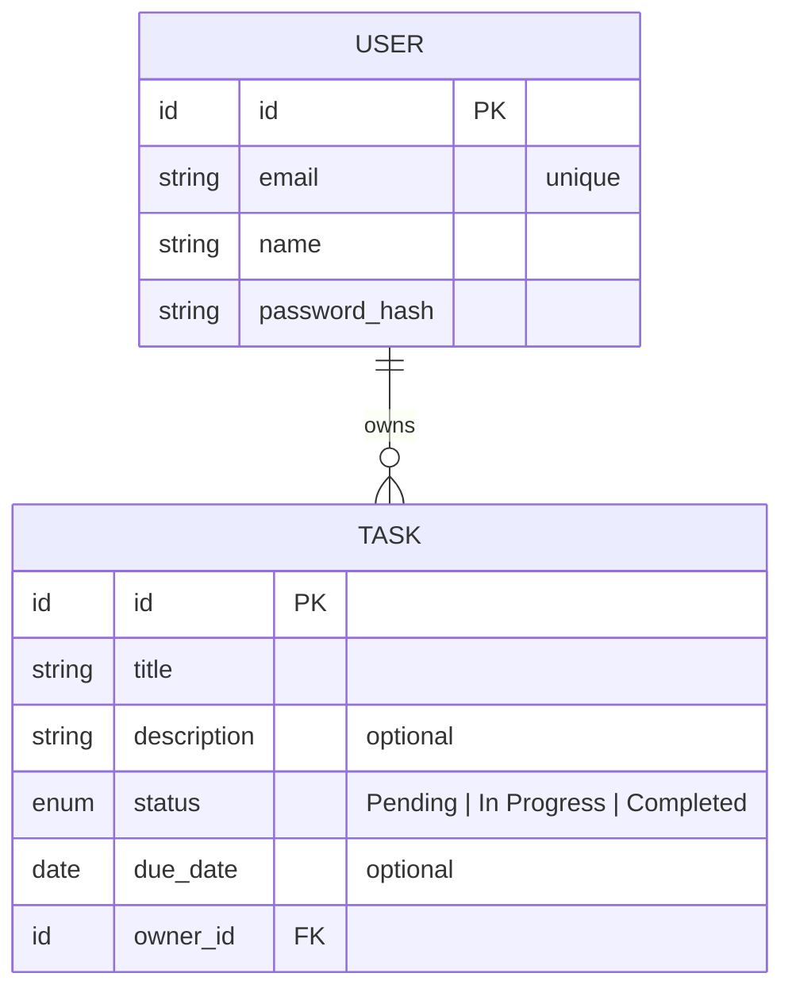

> [📚 INDEX](INDEX.md) / Domain Glossary

# Domain Glossary — Ubiquitous Language

Terms used consistently across all documentation, code, and communication.

## Entity Relationships

## Task Status Values

The three status values above are the valid enum members. Tasks are created as `Pending`.
Status changes are allowed freely via `PATCH /api/tasks/{id}` — there are no enforced
directional transitions for this CRUD-scoped application.

## Core Domain

### Task
A unit of work that a user wants to track. Has a lifecycle from creation to completion or removal.
See [EP02 — Task Management](epics/EP02-task-management.md) for the full CRUD lifecycle.

**Properties:**
- **Title**: short, descriptive name for the task (required)
- **Description**: detailed explanation of what the task involves (optional)
- **Status**: current state in the task lifecycle (required)
- **Due Date**: the date by which the task should be completed (optional)

### Task Status
The current state of a task in its lifecycle:
- **Pending**: task has been created but not started
- **In Progress**: task is actively being worked on
- **Completed**: task has been finished

### User
A person who registers and authenticates to use the system. Each user owns their own tasks.
See [EP01 — User Management](epics/EP01-user-management.md) for registration and authentication flows.

**Properties:**
- **Email**: unique identifier for authentication (required)
- **Password**: secret credential for authentication (required)
- **Name**: display name for the user (required)

## Access Control

### Authenticated User
A user who has successfully logged in and possesses a valid session/token. See
[US-003 — Protected Access](user-stories/US-003-protected-access.md).

### Public Endpoint
An API endpoint accessible without authentication (e.g., registration, login). See
[API Contract — Auth API](architecture/api-contract.md#3-auth-api-public).

### Protected Endpoint
An API endpoint that requires authentication to access. See
[API Contract — Tasks API](architecture/api-contract.md#4-tasks-api-protected).

## Operations

### CRUD
The four basic operations on any resource:
- **Create**: add a new resource
- **Read**: retrieve one or many resources
- **Update**: modify an existing resource
- **Delete**: remove an existing resource

### Task Ownership
A task belongs to the user who created it. Users can only perform CRUD operations on their own tasks.

## Related Documents

- [Project Brief](project-brief.md) — overall vision this glossary supports
- [EP01 — User Management](epics/EP01-user-management.md) and [EP02 — Task Management](epics/EP02-task-management.md) — epics using these terms
- [API Contract](architecture/api-contract.md) — where these entities appear as request/response shapes
