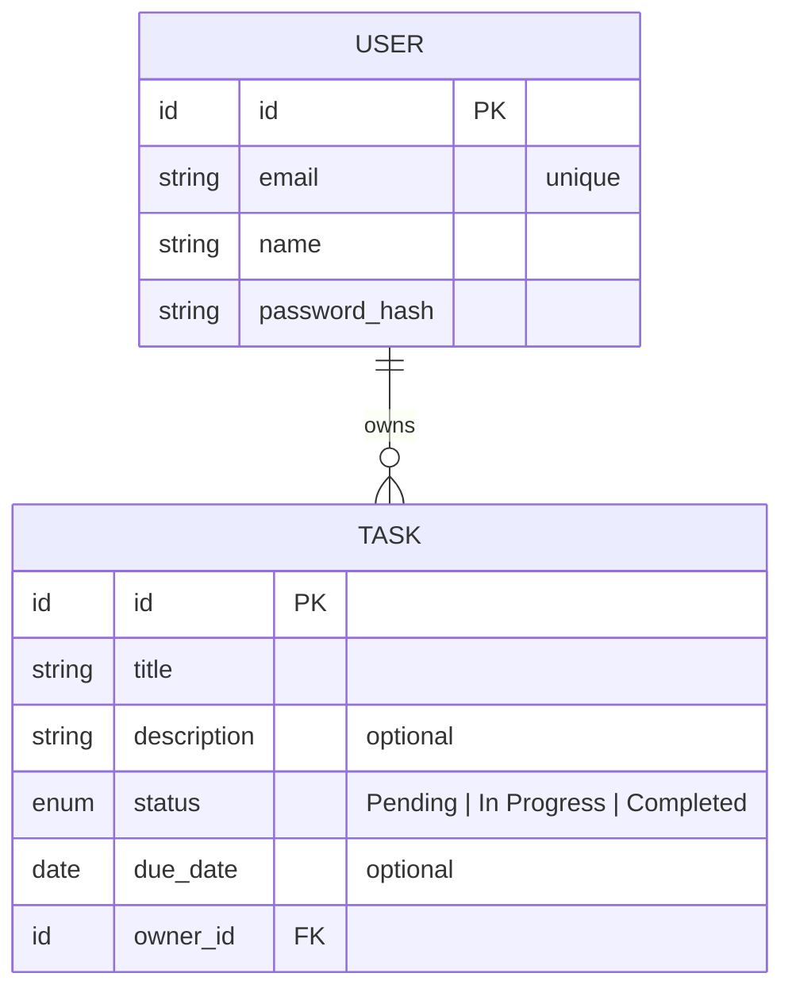
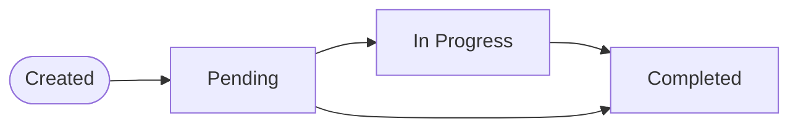

# Domain Glossary — Ubiquitous Language

Terms used consistently across all documentation, code, and communication.

## Entity Relationships

## Task Lifecycle

## Core Domain

### Task
A unit of work that a user wants to track. Has a lifecycle from creation to completion or removal.

**Properties:**
- **Title**: short, descriptive name for the task (required)
- **Description**: detailed explanation of what the task involves (optional)
- **Status**: current state in the task lifecycle (required)
- **Due Date**: the date by which the task should be completed (optional)

### Task Status
The current state of a task in its lifecycle:
- **Pending**: task has been created but not started
- **In Progress**: task is actively being worked on
- **Completed**: task has been finished

### User
A person who registers and authenticates to use the system. Each user owns their own tasks.

**Properties:**
- **Email**: unique identifier for authentication (required)
- **Password**: secret credential for authentication (required)
- **Name**: display name for the user (required)

## Access Control

### Authenticated User
A user who has successfully logged in and possesses a valid session/token.

### Public Endpoint
An API endpoint accessible without authentication (e.g., registration, login).

### Protected Endpoint
An API endpoint that requires authentication to access.

## Operations

### CRUD
The four basic operations on any resource:
- **Create**: add a new resource
- **Read**: retrieve one or many resources
- **Update**: modify an existing resource
- **Delete**: remove an existing resource

### Task Ownership
A task belongs to the user who created it. Users can only perform CRUD operations on their own tasks.
