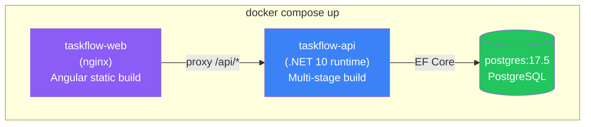
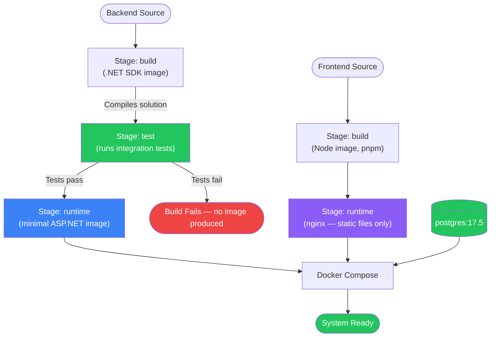
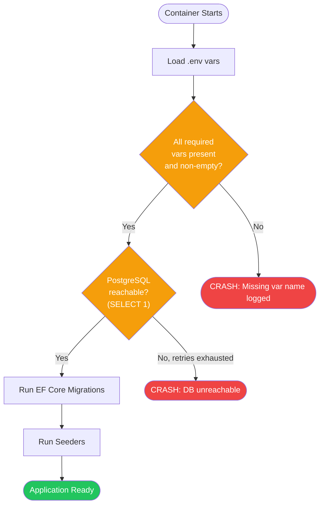
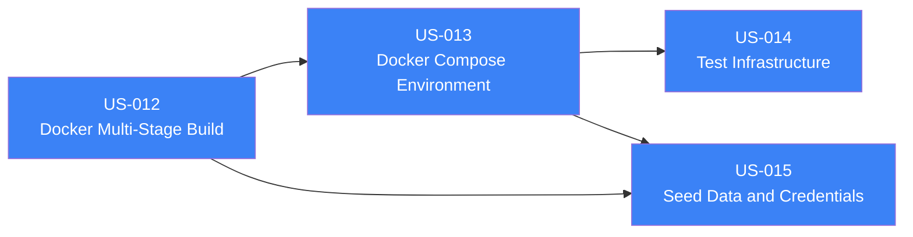

> [📚 INDEX](../INDEX.md) / [Epics](../INDEX.md#epics) / EP00

# EP00 — Project Infrastructure

> **Pinned versions**: [README — Version Manifest](../../README.md#version-manifest) is the
> single source of truth for all dependency versions.

## Summary

Cross-cutting infrastructure that enables development, testing, and deployment of TaskFlow. This
epic is not user-facing — it is developer/evaluator-facing. It covers the Docker multi-stage
build pipeline, the Docker Compose orchestration for local/demo environments, the automated test
infrastructure, the build pipeline contract, and the seed data that makes the system immediately
explorable.

## Business Value

The interviewer runs `docker compose up` and everything works. Tests run automatically as part of
the build and gate it — a broken test means a broken build. Seed data is ready for demo without
any manual setup step. This is the foundation that makes the entire project evaluatable with
minimal friction: no local SDK, no local Node, no local database.

## Docker Compose — 3 Containers

| Container | Base Image | Purpose |
| --------- | ---------- | ------- |
| `postgres` | `postgres:17.5` (pinned) | Database — healthcheck via `pg_isready`, migrations on startup |
| `taskflow-api` | Multi-stage: .NET SDK → ASP.NET runtime | Backend API — validates env vars, connects to `postgres` |
| `taskflow-web` | Multi-stage: Node → nginx | Frontend — serves Angular static, proxies `/api/*` to `taskflow-api` |

**Startup sequence**: `postgres` (healthcheck: `pg_isready`) → `taskflow-api` (depends on postgres,
healthcheck: `/health` endpoint) → `taskflow-web` (depends on api). Fail-fast: if any container
fails its healthcheck, dependent containers do not start.

## Docker Multi-Stage Pipeline

## Environment Variables — Fail-Fast Strategy

| Required Env Var | Purpose | Validation |
| ---------------- | ------- | ---------- |
| `DATABASE_HOST` | PostgreSQL hostname | Non-empty |
| `DATABASE_PORT` | PostgreSQL port | Non-empty, numeric |
| `DATABASE_NAME` | Database name | Non-empty |
| `DATABASE_USER` | PostgreSQL user | Non-empty |
| `DATABASE_PASSWORD` | PostgreSQL password | Non-empty |
| `JWT_SECRET` | Signing key for JWT tokens | Non-empty, minimum length |
| `JWT_ISSUER` | JWT issuer claim | Non-empty |
| `JWT_AUDIENCE` | JWT audience claim | Non-empty |
| `API_PORT` | Port the API listens on | Non-empty, numeric |
| `WEB_PORT` | Port the frontend listens on | Non-empty, numeric |

**Rule**: `.env.example` is committed (with placeholder values). `.env` is gitignored. If any
required var is missing or empty, the application crashes immediately with a clear error message
naming the missing variable — no silent defaults, no fallback values.

## Build Pipeline Contract

The deterministic build pipeline is documented in full at
[Build Pipeline](../architecture/build-pipeline.md). Key points:

- **5 gated stages**: setUp → build → test:static → test:dynamic → test:e2e
- **Each stage gates the next** — failure stops the pipeline, no skipping
- **Artifacts** produced to `./artifacts/` (gitignored): `dist/api`, `dist/web`, `testReports/api|e2e`, `openApi/`
- **Same pipeline in every environment** — local, CI, Docker

## Dependencies — Implementation Order

The four stories in this epic have a strict linear dependency chain — each one depends on the
infrastructure produced by the previous:

| Story | Depends On | Reason |
| ----- | ---------- | ------ |
| US-012 — Docker Multi-Stage Build | None | First story in EP00 — nothing else exists to depend on |
| US-013 — Docker Compose Environment | US-012 | Compose orchestrates the images US-012 builds |
| US-014 — Test Infrastructure | US-013 | Integration tests need the Compose topology (PostgreSQL container, networking) US-013 establishes |
| US-015 — Seed Data and Demo Credentials | US-012, US-013 | Seeding requires a running system — built images (US-012) orchestrated by Compose (US-013) |

## User Stories

- [ ] [US-012 — Docker Multi-Stage Build](../user-stories/US-012-docker-multi-stage-build.md) `Must Have`
- [ ] [US-013 — Docker Compose Environment](../user-stories/US-013-docker-compose-environment.md) `Must Have`
- [ ] [US-014 — Test Infrastructure](../user-stories/US-014-test-infrastructure.md) `Must Have`
- [ ] [US-015 — Seed Data and Demo Credentials](../user-stories/US-015-seed-data-and-credentials.md) `Must Have`

## Acceptance Boundaries

- No stage in the Docker pipeline may skip test execution before producing a runtime image
- The final runtime image must not contain the SDK or source code, only published binaries
- `docker compose up` must be sufficient to run the entire system with zero local installs
- All env vars validated at startup — fail-fast with named error on missing vars
- PostgreSQL is the ONLY database engine — same image in dev, CI, and demo
- All automated tests (integration and E2E) run against PostgreSQL, not in-memory providers
- Tests follow AAA pattern and naming convention defined in [Testing Strategy](../architecture/testing-strategy.md)
- Seed data must be idempotent and must never require manual database setup
- Demo credentials are for evaluation purposes only, not production-strength secrets
- Build pipeline follows the 5-stage gated contract defined in [Build Pipeline](../architecture/build-pipeline.md)
- Unit test projects (TaskFlow.Domain.Tests, TaskFlow.Application.Tests) are scaffolded as part of
  US-014 test infrastructure, per Testing Strategy Section 2.1
- Seed data and demo credentials satisfy the challenge requirement for out-of-the-box evaluator
  access (see US-015)

## Related Documents

- [Build Pipeline](../architecture/build-pipeline.md) — artifacts system, gated stages
- [Tech Stack — Decision 7](../architecture/tech-stack.md#decision-7-docker-strategy) — Docker strategy and 3-container topology
- [Testing Strategy](../architecture/testing-strategy.md) — test infrastructure this epic provides
