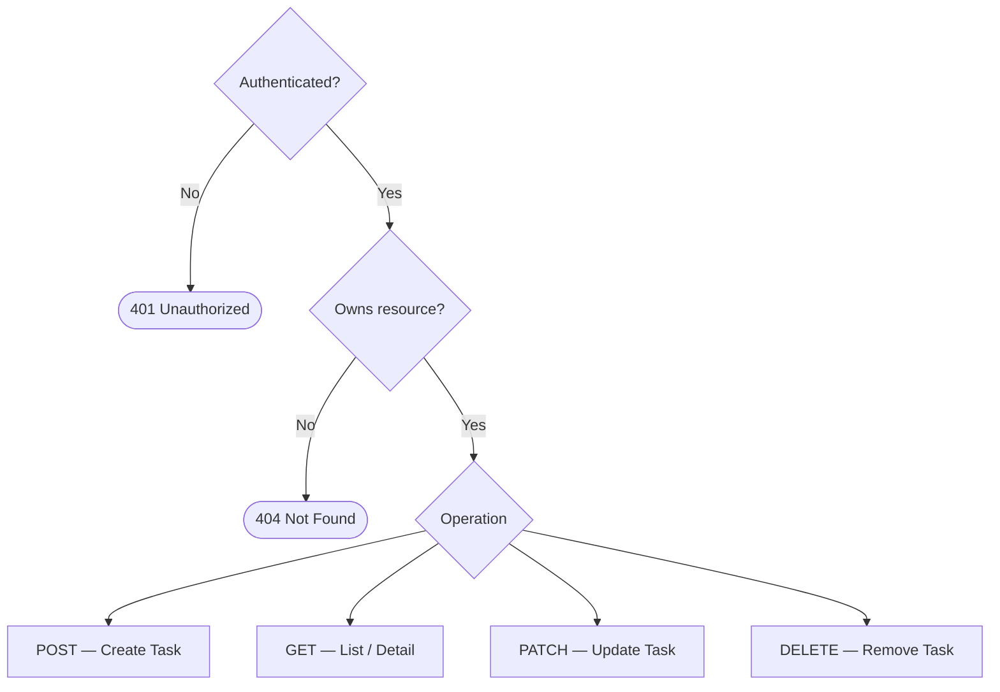

> [📚 INDEX](../INDEX.md) / [Epics](../INDEX.md#epics) / EP01

# EP01 — Task Management

## Summary

Authenticated users can create, view, update, and delete their own tasks. Tasks have a title, description, status, and optional due date. This is the core domain of the application.

## Business Value

This is the primary value proposition of the system — enabling users to organize and track their work through task lifecycle management.

## Task Lifecycle

Tasks are created as `Pending`. Status changes are free-form via `PATCH /api/tasks/{id}` —
there are no enforced directional transitions between the three status values.

## CRUD Operations

## User Stories

- [ ] [**US-004** — Create Task](../user-stories/US-004-create-task.md) `Must Have`
- [ ] [**US-005** — List Tasks](../user-stories/US-005-list-tasks.md) `Must Have`
- [ ] [**US-006** — View Task Detail](../user-stories/US-006-view-task-detail.md) `Must Have`
- [ ] [**US-007** — Update Task](../user-stories/US-007-update-task.md) `Must Have`
- [ ] [**US-008** — Delete Task](../user-stories/US-008-delete-task.md) `Must Have`
- [ ] [**US-009** — Filter Tasks by Status](../user-stories/US-009-filter-tasks-by-status.md) `Should Have`

## Acceptance Boundaries

- All task endpoints require authentication
- Users can only access their own tasks
- Task status is one of three enum values: Pending, In Progress, Completed (free-form via `PATCH`, no enforced transitions)
- Tasks require at minimum a title
- Due date is optional but must be a valid future date when provided

## Related Architecture

- [API Contract — Tasks API](../architecture/api-contract.md#4-tasks-api-protected) — CRUD endpoint specs for tasks
- [API Contract — Filtering](../architecture/api-contract.md#7-filtering) — status filter behavior (US-009)
- [Testing Strategy — US-004 through US-009 coverage](../architecture/testing-strategy.md#33-mapping-acceptance-criteria-to-test-cases)
- [Domain Glossary — Task Status Values](../domain-glossary.md#task-status-values)
