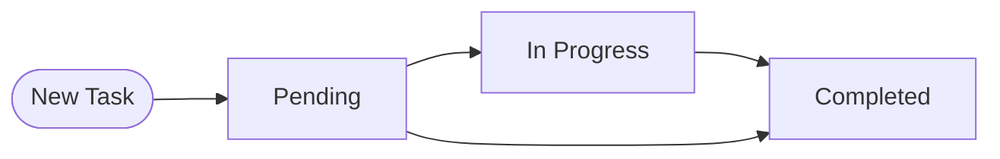
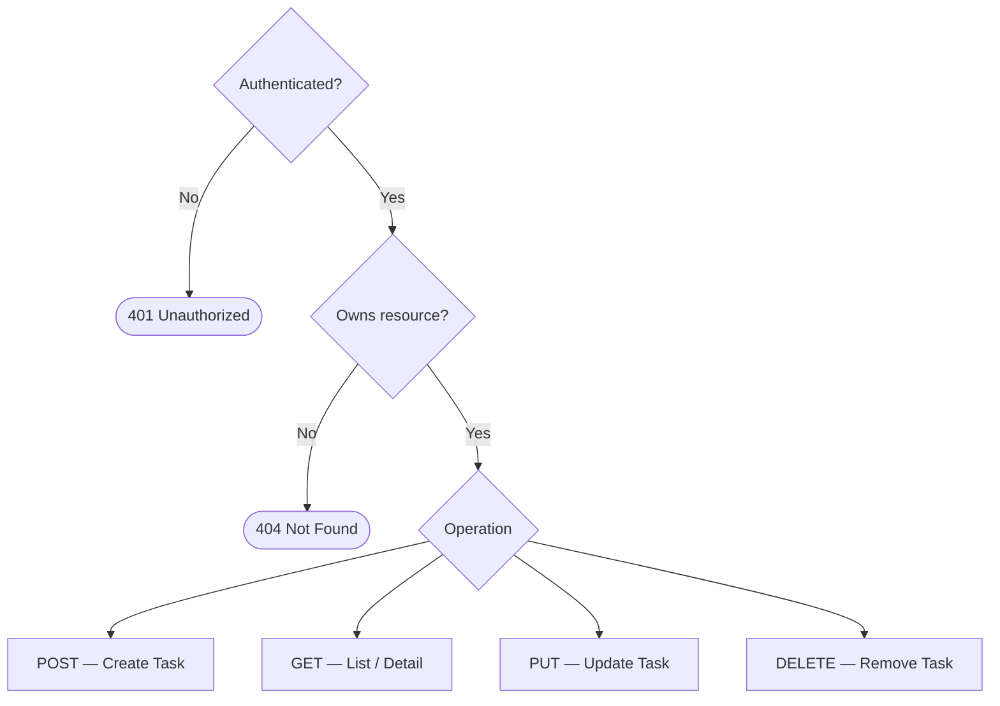

# EP02 — Task Management

## Summary

Authenticated users can create, view, update, and delete their own tasks. Tasks have a title, description, status, and optional due date. This is the core domain of the application.

## Business Value

This is the primary value proposition of the system — enabling users to organize and track their work through task lifecycle management.

## Task Lifecycle

## CRUD Operations

## User Stories

- [ ] **US-004** — Create Task `Must Have`
- [ ] **US-005** — List Tasks `Must Have`
- [ ] **US-006** — View Task Detail `Must Have`
- [ ] **US-007** — Update Task `Must Have`
- [ ] **US-008** — Delete Task `Must Have`
- [ ] **US-009** — Filter Tasks by Status `Should Have`

## Acceptance Boundaries

- All task endpoints require authentication
- Users can only access their own tasks
- Task status follows defined lifecycle: Pending, In Progress, Completed
- Tasks require at minimum a title
- Due date is optional but must be a valid future date when provided
