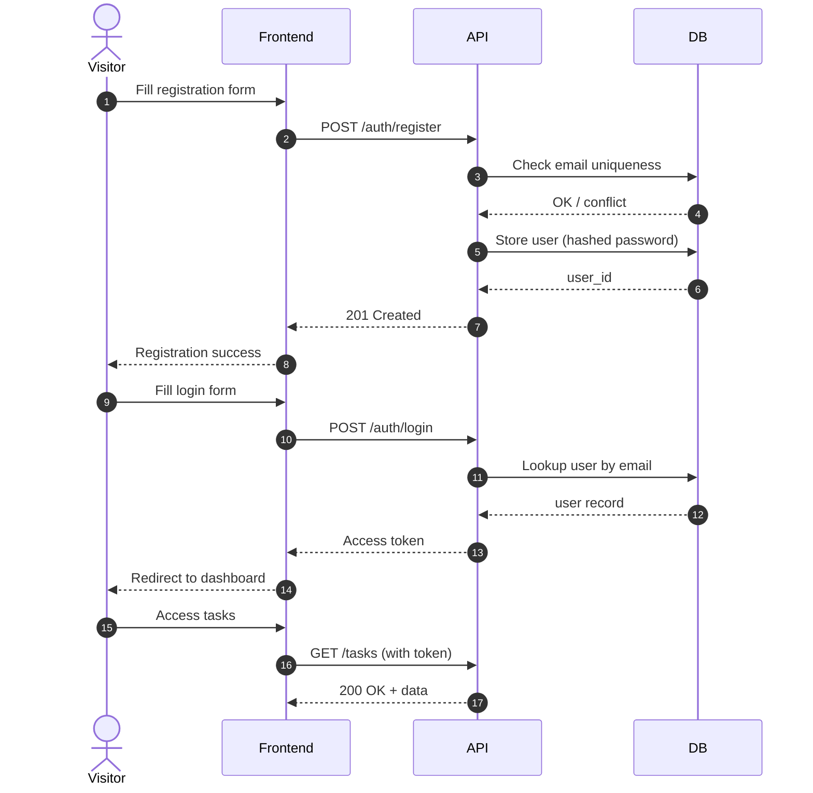

> [📚 INDEX](../INDEX.md) / [Epics](../INDEX.md#epics) / EP02

# EP02 — User Management

## Summary

Users must be able to register, log in, and access protected resources. This epic covers identity and access control for the entire system.

## Business Value

Without user management, there is no task ownership, no privacy, and no access control. This is the foundation for every protected operation in the system.

## Authentication Flow

## User Stories

- [x] [**US-001** — User Registration](../user-stories/US-001-user-registration.md) `Must Have`
- [x] [**US-002** — User Login](../user-stories/US-002-user-login.md) `Must Have`
- [x] [**US-003** — Protected Access](../user-stories/US-003-protected-access.md) `Must Have`

## Acceptance Boundaries

- Users must be uniquely identified by email
- Passwords must never be stored in plain text
- Authentication tokens/sessions must expire
- Public endpoints: registration, login
- Protected endpoints: everything else

## Related Documents

- [Engineering Addenda](EP02-engineering-addenda.md) — technical refinement decisions, batch plan, security specs
- [API Contract — Auth API](../architecture/api-contract.md#3-auth-api-public) — registration and login endpoint specs
- [API Contract — Tasks API](../architecture/api-contract.md#4-tasks-api-protected) — protected endpoint auth rules (US-003)
- [Testing Strategy — US-001 through US-003 coverage](../architecture/testing-strategy.md#33-mapping-acceptance-criteria-to-test-cases)
- [Tech Stack — Decision 4: Authentication Mechanism](../architecture/tech-stack.md#decision-4-authentication-mechanism)
