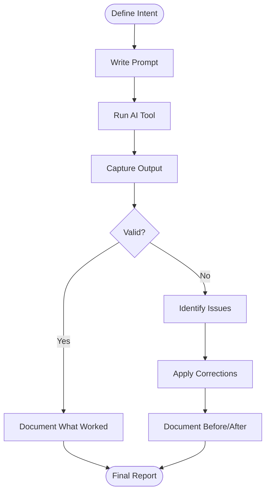

# EP03 — GenAI Process Documentation

## Summary

Document the full process of using a Generative AI coding tool to scaffold or implement the task management API. This is not a feature for end users — it is a deliverable for the interview panel demonstrating AI fluency.

## Business Value

Demonstrates the candidate's ability to leverage AI tools effectively: knowing what to ask, how to validate output, and when to correct or improve suggestions.

## GenAI Documentation Process

## Deliverables

- [ ] **US-010** — Prompt Documentation `Must Have`
- [ ] **US-011** — AI Output Validation Report `Must Have`

## Acceptance Boundaries

- Show the exact prompt(s) used to generate code
- Show the AI's output (or representative sample)
- Describe how the output was validated against requirements
- Document what was corrected or improved and why
- Explain how edge cases, authentication, and validations were handled
- Demonstrate critical thinking, not blind acceptance
