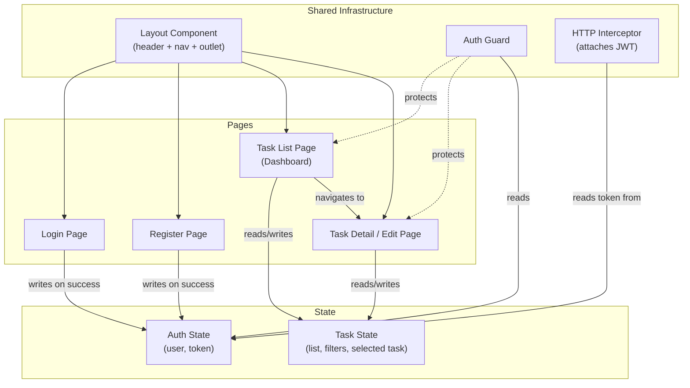
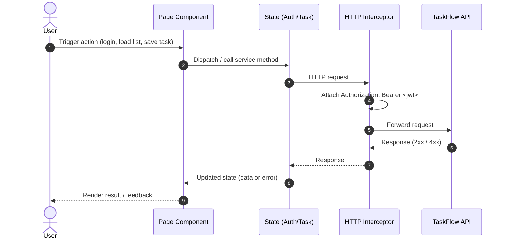

> [📚 INDEX](../INDEX.md) / [Epics](../INDEX.md#epics) / EP04

# EP04 — Frontend (Angular)

## Summary

This epic covers the Angular single-page application (`taskflow-web`) that consumes the TaskFlow
API. It delivers the login and registration screens, the authenticated task dashboard, the task
create/edit form, and the responsive app shell that ties them together. The frontend is the only
client of the API described in [API Contract](../architecture/api-contract.md) — every screen maps
to one or more endpoints defined there.

## Business Value

The backend alone is not usable by an end user. This epic closes that gap by delivering a
responsive, user-friendly interface that lets an authenticated user manage their own tasks
end-to-end, satisfying the challenge requirement to "integrate the backend with a frontend
framework of your choice" with a UI that is both functional and pleasant to use.

## Bootstrap Note

`taskflow-web` is scaffolded with the Angular CLI and then configured with Vitest, Tailwind,
ESLint, and Prettier (see
[Tech Stack — Decision 5](../architecture/tech-stack.md#decision-5-frontend-framework)):

```bash
pnpm dlx @angular/cli new taskflow-web --style=css --routing --ssr=false
```

## Frontend Structure



## Frontend-to-API Data Flow



## User Stories

- [x] [**US-016** — Login & Registration Screen](../user-stories/US-016-login-screen.md) `Must Have`
- [x] [**US-017** — Task List View (Dashboard)](../user-stories/US-017-task-list-view.md) `Must Have`
- [x] [**US-018** — Task Form (Create/Edit)](../user-stories/US-018-task-form.md) `Must Have`
- [x] [**US-019** — Responsive Layout & Navigation](../user-stories/US-019-responsive-layout.md) `Must Have`

## Acceptance Boundaries

- The application is responsive across mobile, tablet, and desktop breakpoints (challenge
  requirement: "responsive and user-friendly").
- Code is organized by feature (pages, shared, state) rather than by file type, keeping components
  and state cleanly separated (challenge requirement: "structured code").
- All task CRUD operations in the UI are backed exclusively by the API endpoints defined in
  [API Contract — Tasks API](../architecture/api-contract.md#4-tasks-api-protected) — no local-only
  or mocked data in the shipped app.
- Every route except Login and Register is protected by the Auth Guard; unauthenticated access
  redirects to Login.
- The JWT issued by [POST /api/auth/login](../architecture/api-contract.md#32-login--post-apiauthlogin)
  is attached to every protected request via the HTTP Interceptor and cleared on logout.

## Related Architecture

- [Tech Stack — Decision 5: Frontend Framework](../architecture/tech-stack.md#decision-5-frontend-framework)
  — why Angular was chosen for `taskflow-web`.
- [API Contract — Auth API](../architecture/api-contract.md#3-auth-api-public) — login/register
  request and response shapes consumed by US-016.
- [API Contract — Tasks API](../architecture/api-contract.md#4-tasks-api-protected) — CRUD endpoints
  consumed by US-017 and US-018.
- [Testing Strategy — Frontend E2E Tests](../architecture/testing-strategy.md#4-frontend-e2e-tests-playwright)
  — Playwright coverage for the flows described in this epic.
