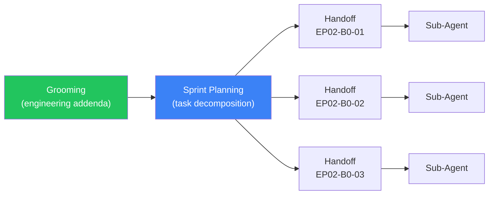
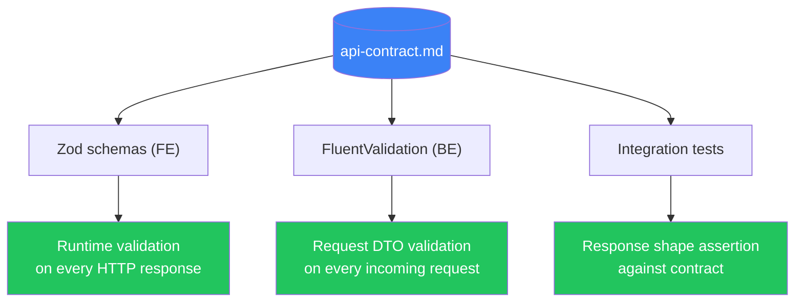
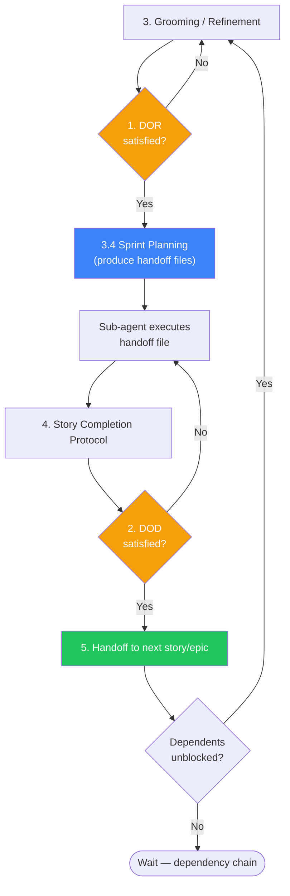

> [📚 INDEX](INDEX.md) / Process Protocols

# Process Protocols — TaskFlow

This document is the anti-hallucination guardrail for TaskFlow implementation. It defines
the conditions under which work may start, the conditions under which work may be declared
complete, and the transitions between phases and sub-agents. No sub-agent may begin a story,
declare it done, or hand it off without satisfying the relevant protocol below.

## Table of Contents

- [1. Definition of Ready (DOR)](#1-definition-of-ready-dor)
- [2. Definition of Done (DOD)](#2-definition-of-done-dod)
- [3. Grooming / Refinement Protocol](#3-grooming--refinement-protocol)
  - [3.4 Sprint Planning — Task Decomposition](#34-sprint-planning--task-decomposition)
- [4. Story Completion Protocol](#4-story-completion-protocol)
- [5. Handoff Protocol](#5-handoff-protocol)
- [6. API Contract Validation Protocol](#6-api-contract-validation-protocol)
- [Overall Process Flow](#overall-process-flow)
- [Related Documents](#related-documents)

## 1. Definition of Ready (DOR)

A user story or epic MUST meet every condition below before any sub-agent may start
implementation work on it. If any box is unchecked, the story is NOT ready — send it back
to grooming.

- [ ] All acceptance criteria are written in Given/When/Then format
- [ ] API contract endpoints touched by the story are defined in
      [api-contract.md](architecture/api-contract.md) (backend stories only)
- [ ] Test names/descriptions for the story are listed in
      [testing-strategy.md](architecture/testing-strategy.md)
- [ ] Dependencies on other stories are identified and either resolved (dependency is DONE)
      or explicitly deferred with a documented reason
- [ ] Architecture decisions relevant to the story's domain are documented (see
      [clean-architecture.md](architecture/clean-architecture.md) and
      [tech-stack.md](architecture/tech-stack.md))
- [ ] No open questions or ambiguities remain in the story text

## 2. Definition of Done (DOD)

A user story or epic MUST meet every condition below before it can be marked complete.
Partial completion is not completion — all boxes must be checked with evidence.

- [ ] All acceptance criteria pass, verified by test evidence (not by inspection alone)
- [ ] Integration tests written and passing (backend stories)
- [ ] E2E tests written and passing (frontend stories)
- [ ] Unit tests for all Domain entities/value objects and Application use cases touched by
      this story are written and passing (per Testing Strategy Section 2.1). Stories that
      touch zero Domain or Application code (e.g., pure infrastructure) are exempt.
- [ ] API contract compliance validated — Zod schemas on the frontend, FluentValidation on
      the backend (see [Section 6](#6-api-contract-validation-protocol)). Stories that touch
      no API request/response surface (e.g., pure infrastructure like US-012, US-013) are
      exempt.
- [ ] No regressions — the full test suite passes, not just the new tests
- [ ] Code reviewed via sub-agent review
- [ ] Changes committed using conventional commit format (`type(scope): description`)
- [ ] Corresponding checkbox in [INDEX.md](INDEX.md) is marked done

## 3. Grooming / Refinement Protocol

Every epic and its user stories MUST be groomed before a sprint or implementation batch
starts. Grooming bridges the gap between Discovery (high-level stories) and Implementation
(sprint-ready work). Discovery defines the **what** and **why**; Refinement adds the **how**.

### 3.1 Discovery vs. Refinement

| Aspect | Discovery | Refinement |
| ------ | --------- | ---------- |
| Depth | High-level: persona, value, acceptance criteria | Technical: approach, migrations, test strategy, infra needs |
| Output | User stories with Given/When/Then ACs | Sprint-ready stories with technical approach defined |
| Code | None | None — but technical decisions are made |
| Timing | Once per epic (before architecture) | Once per epic (before implementation) |

### 3.2 Refinement Checklist

- [ ] Read the epic and all of its user stories in full
- [ ] Cross-reference each story against [api-contract.md](architecture/api-contract.md)
      for endpoint alignment
- [ ] Cross-reference each story against
      [testing-strategy.md](architecture/testing-strategy.md) for test coverage
- [ ] Verify the [Definition of Ready](#1-definition-of-ready-dor) checklist for every story
      in the batch
- [ ] Identify implementation order based on dependencies between stories
- [ ] Define the technical approach per story — the team defines **how** to implement,
      the PO/orchestrator defines **what** and **why**
- [ ] Size each story — if a story cannot be completed in one implementation batch, split it
- [ ] Identify cross-epic dependencies and infrastructure prerequisites
- [ ] Identify risks and unknowns — document mitigations or spikes needed
- [ ] Break the epic into implementation batches if it is too large for one pass
- [ ] Document all discoveries, risks, and decisions made during grooming

### 3.3 Anti-Patterns

- **Over-refining**: aiming for absolute certainty when basic clarity is enough — refine to
  "ready to commit", not to "perfect spec"
- **Refining too early**: stories far from implementation drift — refine only the next epic
- **Skipping the "how"**: discovery-level stories without technical approach lead to
  implementation surprises

### 3.4 Sprint Planning — Task Decomposition

After grooming produces an engineering addenda and the DOR is satisfied, the orchestrator
decomposes each batch into **individual task handoff files**. Each handoff is a self-contained
contract that a sub-agent can execute autonomously — no ad-hoc prompts, no improvisation.

**Inputs**: engineering addenda (grooming output), batch plan, DOR-satisfied stories.

**Output**: one handoff file per sub-task, following the
[Handoff Template](process/handoff-template.md).

**Ceremony**:

1. The orchestrator (or a planning agent) breaks each batch into atomic tasks
2. Each task gets a handoff file with 11 sections: metadata, objective, pre-conditions,
   context bundle, deliverables, quality gates, boundaries, anti-patterns, rollback,
   compact rules, and status protocol
3. The orchestrator runs the [pre-flight checklist](process/handoff-template.md#orchestrator-pre-flight-checklist)
   before delegating each task
4. Sub-agents receive the handoff file as their prompt — nothing more, nothing less

**Rule**: if a handoff exceeds 300 lines, the task is too large — split it.

## 4. Story Completion Protocol

When a sub-agent reports DONE on a user story, the orchestrator MUST run this checklist in
order before accepting the report:

1. Run the Post-Delegation Checkpoint (PDC) — all 4 steps (ECHO, VERIFY, MARK, DECIDE) as
   defined in [AGENTS.md](AGENTS.md#post-delegation-checkpoint-pdc)
2. Verify every acceptance criterion against test evidence — no criterion is accepted on
   the sub-agent's word alone
3. Run the full test suite and confirm no regressions were introduced
4. Verify API contract compliance — response shapes match
   [api-contract.md](architecture/api-contract.md) exactly
5. Update [INDEX.md](INDEX.md) — mark the story's checkbox as done
6. Update the epic — if all of its stories are done, mark the epic checkbox as done too
7. Commit with `feat(scope): description` or `test(scope): description`

## 5. Handoff Protocol

Work transitions between phases and between sub-agents only under the following rules.

- **Phase transition** (for example Architecture → Implementation): the orchestrator
  verifies [DOR](#1-definition-of-ready-dor) for the first implementation batch, updates
  the current phase in [AGENTS.md](AGENTS.md#current-phase), and commits the phase
  transition
- **Between sub-agents**: the previous sub-agent's output is validated via PDC before the
  next sub-agent receives it. Context is passed explicitly in the delegation prompt — it is
  never assumed to carry over
- **Epic completion → next epic**: full [DOD](#2-definition-of-done-dod) is verified and the
  regression suite passes before grooming of the next epic begins
- **Story dependency chain**: if US-B depends on US-A, US-A must be DONE (full DOD
  satisfied) before US-B can start

## 6. API Contract Validation Protocol

[api-contract.md](architecture/api-contract.md) is the single source of truth for every
request and response shape in TaskFlow. Both the frontend and the backend validate against
it independently, and both must be updated together whenever the contract changes.

- [ ] **Frontend (Angular)**: Zod is installed. A schema exists for every API response shape
      defined in api-contract.md. Every HTTP service method parses its response through the
      matching Zod schema. A schema mismatch fails the test, not silently passes through
- [ ] **Backend (.NET)**: FluentValidation (or equivalent) validates every request DTO
      against the contract. Response shapes are asserted in integration tests against the
      expected contract shapes
- [ ] **Bidirectional enforcement**: frontend and backend validate against the SAME source
      of truth. A contract change requires updating both sides in the same batch of work —
      neither side drifts ahead of the other

### Contract Validation Flow

## Overall Process Flow

## Related Documents

- [INDEX.md](INDEX.md) — documentation map and completion checkboxes
- [AGENTS.md](AGENTS.md) — agent roles, delegation contract, PDC, escalation rules
- [API Contract](architecture/api-contract.md) — endpoint specifications and shapes
  enforced by [Section 6](#6-api-contract-validation-protocol)
- [Testing Strategy](architecture/testing-strategy.md) — test levels and acceptance
  criteria mapping referenced by [DOR](#1-definition-of-ready-dor) and
  [DOD](#2-definition-of-done-dod)
