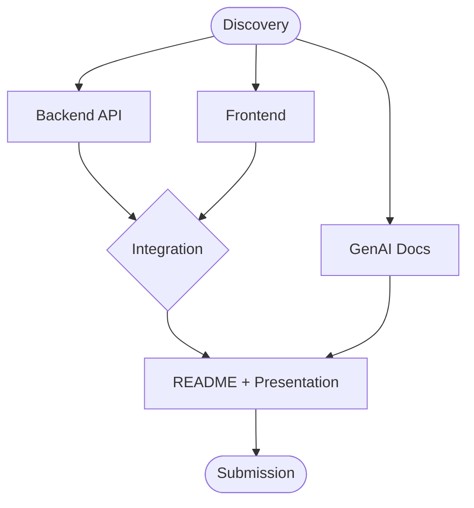

# Project Brief — TaskFlow

## Vision

A task management system where users can register, authenticate, and manage their personal tasks through a web interface backed by a RESTful API.

## Problem Statement

Users need a simple, reliable way to create, organize, and track tasks with deadlines and statuses. The system must ensure that each user's tasks are private and only accessible after authentication.

## Deliverable Map

## Deliverables

- [ ] **D1** — Backend API: RESTful API with CRUD operations, user auth, layered architecture
- [ ] **D2** — Frontend: Responsive web UI with CRUD operations connected to the API
- [ ] **D3** — GenAI Documentation: Prompt engineering process, AI output, validation, and corrections
- [ ] **D4** — Presentation: README with thought process, setup instructions, user story

## Constraints

- Single public GitHub repository
- Seeded data and credentials for demo purposes
- Clean Architecture principles (separation of concerns, component independence)
- Test-Driven Development methodology
- Deadline: 2026-07-13 at 11:00 CDT
- No further work allowed after submission

## Evaluation Criteria

| Criterion | Weight | Description |
|-----------|--------|-------------|
| Clean Architecture | High | Separation of concerns, component independence |
| Application Testing | High | Sufficient coverage, TDD preferred |
| Code Quality | High | Readable, well-organized, best practices |
| Functionality | High | Works without errors or console warnings |
| Presentation | Medium | Clear, concise, backend + frontend mastery |
| GenAI Tools | Medium | Prompt engineering fluency, critical thinking |

## Post-Submission

Presentation via Google Meet/Zoom with screen share. Code review by interview panel. Must explain user story, design choices, technical architecture, and demonstrate functionality.
