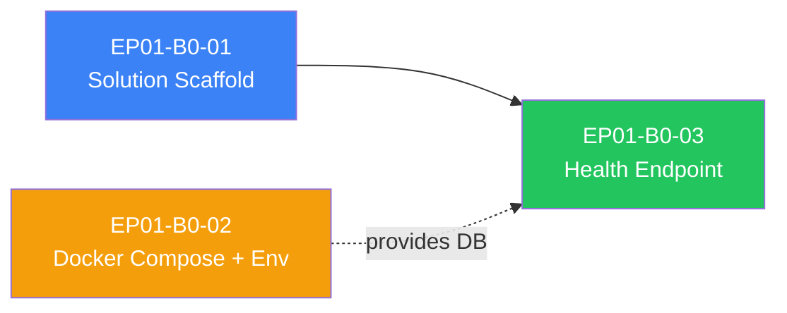

> [📚 INDEX](../../INDEX.md) / [EP01](../../epics/EP01-user-management.md) / Batch 0 Plan

# EP01 — Batch 0: Infra Bootstrap

Batch summary for the first implementation batch of EP01 (User Management). Batch 0 lays the
foundation every later batch depends on: the .NET solution structure, the local PostgreSQL
environment, and a working health endpoint that proves the API boots and can reach the database.
No domain logic, no auth, no entities — pure scaffolding.

## Table of Contents

- [1. Scope](#1-scope)
- [2. Task List](#2-task-list)
- [3. Dependency Graph](#3-dependency-graph)
- [4. Execution Order](#4-execution-order)
- [5. Definition of Done — Batch 0](#5-definition-of-done--batch-0)
- [6. Related Documents](#6-related-documents)

## 1. Scope

Per the [EP01 Engineering Addenda — Batch Plan](../../epics/EP01-engineering-addenda.md#12-batch-plan),
Batch 0 delivers:

- .NET solution with 8 projects (4 src + 4 test), wired with correct project references
- `docker-compose.yml` running PostgreSQL 17.5, plus `.env.example` / `.env`
- `GET /health` endpoint with `Program.cs` as composition root and fail-fast env var validation

Batch 0 produces no business logic. Everything here is infrastructure that Batch 1 (Domain +
Application) and later batches build on top of.

## 2. Task List

| Task ID | Task Name | Persona | Model | Depends On |
| --- | --- | --- | --- | --- |
| [EP01-B0-01](EP01-B0-01-solution-scaffold.md) | Solution Scaffold | Uncle Bob | sonnet | none |
| [EP01-B0-02](EP01-B0-02-docker-environment.md) | Docker Compose + Environment | Kelsey Hightower | sonnet | none |
| [EP01-B0-03](EP01-B0-03-health-endpoint.md) | Health Endpoint + Program.cs | Uncle Bob | sonnet | EP01-B0-01 |

## 3. Dependency Graph

`EP01-B0-01` and `EP01-B0-02` have no dependency on each other and can run in parallel.
`EP01-B0-03` requires `EP01-B0-01` (the solution must exist before Program.cs can be written)
and benefits from `EP01-B0-02` being complete so the health check's database probe can be
exercised end-to-end, though it is not a hard blocker — the endpoint must return `db: "down"`
gracefully when PostgreSQL is unreachable.

## 4. Execution Order

1. **Parallel wave 1**: `EP01-B0-01` (Solution Scaffold) and `EP01-B0-02` (Docker Compose +
   Environment) — independent, no shared files.
2. **Sequential**: `EP01-B0-03` (Health Endpoint + Program.cs) — starts only after
   `EP01-B0-01` reports `DONE` with `dotnet build` passing. Verify against a running
   `EP01-B0-02` database when available for the full `db: "ok"` path, but the endpoint must
   also be verified against a stopped database for the `db: "down"` path.

## 5. Definition of Done — Batch 0

- [x] `dotnet build` exits 0 across the full solution
- [x] `dotnet test` exits 0 (empty test projects pass trivially)
- [x] `dotnet list reference` confirms the reference graph in
  [Clean Architecture — Section 4](../../architecture/clean-architecture.md#4-project-references)
- [x] `docker compose config` validates
- [x] `docker compose up db -d` starts PostgreSQL 17.5 and `pg_isready` reports ready
- [x] `curl http://localhost:5050/health` returns `200 OK` with `status: "ok"`
  (port 5050 — macOS AirPlay Receiver holds 5000)
- [x] Health endpoint reports `db: "ok"` when the `db` container is running and `db: "down"`
  when it is stopped — never crashes either way
- [x] Missing required env var causes the API to fail fast at startup with a named error
- [x] No WeatherForecast template boilerplate remains in `TaskFlow.API`

## 6. Related Documents

- [EP01 — Engineering Addenda](../../epics/EP01-engineering-addenda.md) — grooming decisions,
  batch plan
- [Clean Architecture](../../architecture/clean-architecture.md) — project structure and
  reference graph
- [API Contract](../../architecture/api-contract.md) — `GET /health` spec
- [Build Pipeline](../../architecture/build-pipeline.md) — Stage 0 (setUp) and Stage 1 (build)
  gates this batch must satisfy
- [Handoff Template](../../process/handoff-template.md) — format used by every handoff file
  in this batch
- [AGENTS.md](../../../AGENTS.md) — delegation contract, compact rules, model assignments
