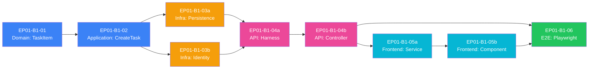

> [📚 INDEX](../../INDEX.md) / [EP01](../../epics/EP01-task-management.md) / Batch 1 Plan

# EP01 — Batch 1: Create Task

Batch summary for the first implementation batch of EP01 (Task Management). Batch 1 delivers
the core feature: creating a task with title, description, and priority. The batch spans from
domain layer (TaskItem entity) through application logic (CreateTask command handler) to
infrastructure (EF Core persistence, seed data), API (TasksController + tests), frontend
(TaskService + CreateTaskComponent), and end-to-end validation (Playwright suite).

## Table of Contents

- [1. Scope](#1-scope)
- [2. Task List](#2-task-list)
- [3. Dependency Graph](#3-dependency-graph)
- [4. Execution Order](#4-execution-order)
- [5. Definition of Done — Batch 1](#5-definition-of-done--batch-1)
- [6. Related Documents](#6-related-documents)

## 1. Scope

Per the [EP01 Engineering Addenda — Batch Plan](../../epics/EP01-engineering-addenda.md#12-batch-plan),
Batch 1 delivers the "Create Task" feature (US-004) across all layers:

- **Domain**: `TaskItem` entity with `Title`, `Description`, `Priority` properties; domain exceptions;
  value objects where applicable
- **Application**: `CreateTaskCommand`, validator, and command handler with DDD-style business logic
- **Infrastructure**: EF Core context + migration to create `Tasks` table; seed data for
  `ICurrentUserContext` (identity)
- **API**: `TasksController` with `POST /tasks` endpoint; integration tests with test harness and
  composition root
- **Frontend**: `TaskService` with Zod schema for request/response validation; `CreateTaskComponent`
  with form binding and submission
- **E2E**: Playwright suite covering the full user journey (navigate → fill form → submit → verify
  task appears in list)

The batch refines the original 6-task breakdown into 9 focused tasks to maintain single responsibility
and keep files under 300 lines. Tasks 03a and 03b are parallelizable; E2E (06) is the final quality gate.

## 2. Task List

| Task ID | Task Name | Status | Depends On |
| --- | --- | --- | --- |
| [EP01-B1-01](EP01-B1-01-domain-taskitem.md) | Domain: TaskItem Entity + Exceptions + Constants | planned | — |
| [EP01-B1-02](EP01-B1-02-application-createtask.md) | Application: CreateTask Command/Validator/Handler | planned | EP01-B1-01 |
| [EP01-B1-03a](EP01-B1-03a-infrastructure-persistence.md) | Infrastructure: EF Core Persistence + Migration | planned | EP01-B1-01, EP01-B1-02 |
| [EP01-B1-03b](EP01-B1-03b-infrastructure-identity.md) | Infrastructure: Seed Identity (ICurrentUserContext) | planned | EP01-B1-02 |
| [EP01-B1-04a](EP01-B1-04a-api-harness.md) | API: Test Harness + Composition Root | planned | EP01-B1-02, EP01-B1-03a, EP01-B1-03b |
| [EP01-B1-04b](EP01-B1-04b-api-controller.md) | API: TasksController + Integration Tests | planned | EP01-B1-04a |
| [EP01-B1-05a](EP01-B1-05a-frontend-dataaccess.md) | Frontend: Data Access (TaskService + Zod schema) | planned | EP01-B1-04b |
| [EP01-B1-05b](EP01-B1-05b-frontend-component.md) | Frontend: CreateTaskComponent + Form | planned | EP01-B1-05a |
| [EP01-B1-06](EP01-B1-06-e2e-playwright.md) | E2E: Create Task Playwright Suite | planned | EP01-B1-04b, EP01-B1-05b |

## 3. Dependency Graph

Tasks 03a and 03b are **parallelizable** (both depend only on 02, not on each other). Tasks 04a, 04b,
05a, 05b follow in sequence within their layers. Task 06 (E2E) is the final quality gate and depends
on both 04b (API ready) and 05b (frontend ready).

## 4. Execution Order

### Phase 1: Domain + Application (Sequential)

1. **EP01-B1-01**: Domain layer — `TaskItem` entity, exceptions, constants
2. **EP01-B1-02**: Application layer — `CreateTaskCommand`, validator, handler

### Phase 2: Infrastructure (Parallel)

3a. **EP01-B1-03a**: EF Core context, migration, schema
3b. **EP01-B1-03b**: Identity seed data, `ICurrentUserContext` wiring

### Phase 3: API (Sequential)

4a. **EP01-B1-04a**: Test harness, composition root, dependency injection
4b. **EP01-B1-04b**: `TasksController`, integration tests

### Phase 4: Frontend (Sequential)

5a. **EP01-B1-05a**: `TaskService`, Zod schemas, HTTP client
5b. **EP01-B1-05b**: `CreateTaskComponent`, form binding, submission logic

### Phase 5: E2E Validation (Final)

6. **EP01-B1-06**: Playwright suite — full user journey validation

## 5. Definition of Done — Batch 1

- [x] `dotnet build` exits 0 across the full solution
- [x] `dotnet test` exits 0 for all .NET unit and integration tests
- [x] `TaskItem` entity has `Id`, `Title`, `Description`, `Priority`, `CreatedAt`, `CreatedBy` properties
- [x] `CreateTaskCommand` validator enforces: title required and 1–255 chars, description optional,
  priority is valid enum value
- [x] EF Core migration creates `Tasks` table with correct columns and constraints
- [x] Seeded identity context provides a known user ID for test and development
- [x] `POST /tasks` endpoint accepts JSON `{ "title": "...", "description": "...", "priority": "..." }`
- [x] API returns `201 Created` with Location header pointing to `GET /tasks/{id}`
- [x] Integration tests cover: valid create, missing title, title too long, invalid priority
- [x] Frontend `TaskService` exports `createTask()`, `getTask()`, `listTasks()` functions
- [x] `CreateTaskComponent` renders form with title input, description textarea, priority select
- [x] Form submission calls `createTask()` and navigates to task detail (or list) on success
- [x] Zod schema validates client-side before sending to API
- [x] Playwright suite passes: navigate to create page, fill form, submit, verify task in list
- [x] No console errors or warnings in browser DevTools during E2E run

## 6. Related Documents

- [EP01 — Engineering Addenda](../../epics/EP01-engineering-addenda.md) — grooming decisions,
  batch plan
- [Clean Architecture](../../architecture/clean-architecture.md) — project structure and
  reference graph
- [API Contract](../../architecture/api-contract.md) — `POST /tasks` request/response spec
- [Build Pipeline](../../architecture/build-pipeline.md) — test, build, and E2E gates this batch
  must satisfy
- [Handoff Template](../../process/handoff-template.md) — format used by every handoff file
  in this batch
- [AGENTS.md](../../../AGENTS.md) — delegation contract, compact rules, model assignments
