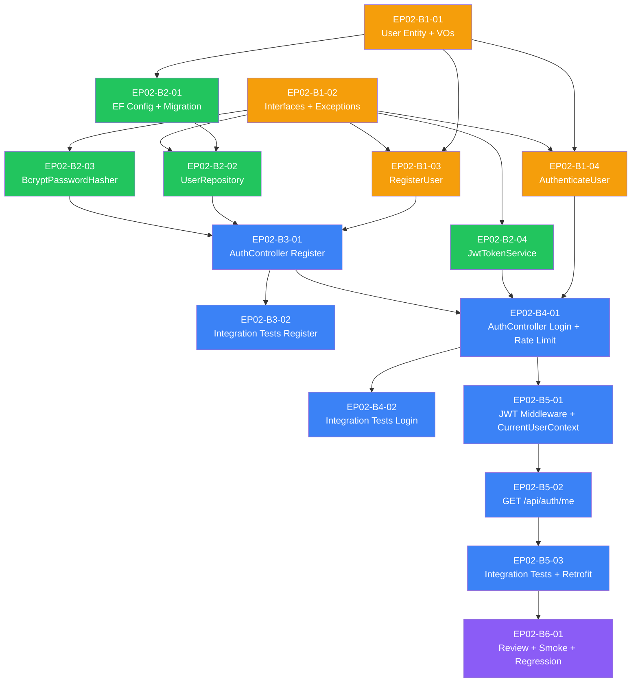

> [📚 INDEX](../../INDEX.md) / [EP02](../../epics/EP02-user-management.md) / Batch 1-6 Plan

# EP02 — Batches 1 to 6: Domain Through Hardening

Master plan for the remaining EP02 (User Management) implementation batches. Batch 0
(infra bootstrap) is DONE. This document covers Batch 1 (Domain + Application) through
Batch 6 (Hardening), delivering US-001 (Registration), US-002 (Login), and US-003
(Protected Access) end to end.

## Table of Contents

- [1. Scope Per Batch](#1-scope-per-batch)
- [2. Task List](#2-task-list)
- [3. Dependency Graph](#3-dependency-graph)
- [4. Execution Order](#4-execution-order)
- [5. Definition of Done — Batches 1-6](#5-definition-of-done--batches-1-6)
- [6. Related Documents](#6-related-documents)

## 1. Scope Per Batch

Per the [EP02 Engineering Addenda — Batch Plan](../../epics/EP02-engineering-addenda.md#12-batch-plan):

- **Batch 1 — Domain + Application**: `User` entity, `Email`/`PasswordHash` value objects,
  `IUserRepository`, `IPasswordHasher`, `ITokenService`, domain exceptions,
  `RegisterUser` and `AuthenticateUser` use cases with FluentValidation validators and unit
  tests. Zero infrastructure, zero HTTP.
- **Batch 2 — Infrastructure**: EF Core 10.0.9 + Npgsql 10.0.3 `User` entity configuration
  and migration, `UserRepository` (LINQ only), `BcryptPasswordHasher`, `JwtTokenService`.
- **Batch 3 — API (US-001 Register)**: `AuthController` register action, domain-exception
  → HTTP mapping middleware, integration tests for `POST /api/auth/register`.
- **Batch 4 — API (US-002 Login)**: `AuthController` login action, rate limiting
  (5/min/IP, exponential backoff), integration tests for `POST /api/auth/login`.
- **Batch 5 — API (US-003 Protected Access)**: JWT bearer authentication middleware,
  `JwtCurrentUserContext` (replaces `SeedCurrentUserContext`), `GET /api/auth/me`,
  integration tests, and retrofit of existing EP01 task integration tests to run under
  real JWT auth instead of the seed shim.
- **Batch 6 — Hardening**: code review pass, Playwright auth smoke test, full regression
  suite across Domain/Application/Integration/E2E.

Batch 1 has no dependency on Docker or PostgreSQL — it is pure C# with NSubstitute mocks,
matching the Clean Architecture boundary already established in EP01.

## 2. Task List

| Task ID | Task Name | Persona | Model | Depends On |
| --- | --- | --- | --- | --- |
| [EP02-B1-01](EP02-B1-01-domain-entity.md) | Domain — User Entity, Email VO, PasswordHash VO | Uncle Bob | sonnet | none |
| [EP02-B1-02](EP02-B1-02-domain-interfaces.md) | Domain — Interfaces + Exceptions | Uncle Bob | sonnet | none |
| [EP02-B1-03](EP02-B1-03-register-user.md) | Application — RegisterUser Use Case | Uncle Bob | sonnet | EP02-B1-01, EP02-B1-02 |
| [EP02-B1-04](EP02-B1-04-authenticate-user.md) | Application — AuthenticateUser Use Case | Uncle Bob | sonnet | EP02-B1-01, EP02-B1-02 |
| [EP02-B2-01](EP02-B2-01-ef-user-configuration-migration.md) | EF Core User Configuration + Migration | Uncle Bob | sonnet | EP02-B1-01 |
| [EP02-B2-02](EP02-B2-02-user-repository.md) | UserRepository Implementation | Uncle Bob | sonnet | EP02-B2-01, EP02-B1-02 |
| [EP02-B2-03](EP02-B2-03-bcrypt-password-hasher.md) | BcryptPasswordHasher Implementation | Uncle Bob | sonnet | EP02-B1-02 |
| [EP02-B2-04](EP02-B2-04-jwt-token-service.md) | JwtTokenService Implementation | Uncle Bob | sonnet | EP02-B1-02 |
| EP02-B3-01 | AuthController Register + Exception Handler | Uncle Bob | sonnet | EP02-B1-03, EP02-B2-02, EP02-B2-03 |
| EP02-B3-02 | Integration Tests for Registration | Kent C. Dodds | sonnet | EP02-B3-01 |
| EP02-B4-01 | AuthController Login + Rate Limiting | Uncle Bob | sonnet | EP02-B1-04, EP02-B2-04, EP02-B3-01 |
| EP02-B4-02 | Integration Tests for Login | Kent C. Dodds | sonnet | EP02-B4-01 |
| EP02-B5-01 | JWT Auth Middleware + JwtCurrentUserContext | Uncle Bob | sonnet | EP02-B4-01 |
| EP02-B5-02 | GET /api/auth/me Endpoint | Uncle Bob | sonnet | EP02-B5-01 |
| EP02-B5-03 | Integration Tests + Retrofit Existing Task Tests with Auth | Kent C. Dodds | sonnet | EP02-B5-02 |
| EP02-B6-01 | Code Review + Playwright Auth Smoke + Regression | Debbie O'Brien | sonnet | EP02-B5-03 |

## 3. Dependency Graph

`EP02-B1-01` and `EP02-B1-02` are independent (entity/VOs vs. interfaces/exceptions) and
run in parallel. Both `EP02-B1-03` and `EP02-B1-04` need the entity, VOs, repository
interface, hasher interface, token-service interface, and the two domain exceptions —
so both wait on `B1-01` AND `B1-02`, but `B1-03` and `B1-04` are independent of each
other and can run in parallel once `B1-01`/`B1-02` are DONE.

Batch 2 tasks fan out from `B1-02` (the interface contracts each implementation
satisfies): `B2-02` also needs the EF configuration from `B2-01` first, but `B2-03`
(BCrypt) and `B2-04` (JWT) have no Batch-2 sibling dependency and run in parallel with
`B2-01`/`B2-02`.

Batches 3 through 6 are strictly sequential — each API batch builds the concrete
endpoint that exercises the use case + infrastructure wired in prior batches, and each
batch's integration tests must pass before the next batch starts.

## 4. Execution Order

1. **Parallel wave 1**: `EP02-B1-01` (User Entity + VOs) and `EP02-B1-02` (Interfaces +
   Exceptions) — no shared files, independent Domain-layer work.
2. **Parallel wave 2**: `EP02-B1-03` (RegisterUser) and `EP02-B1-04` (AuthenticateUser) —
   both require wave 1 complete; independent of each other (different use-case folders).
3. **Parallel wave 3**: `EP02-B2-01` (EF Config + Migration), `EP02-B2-03` (BCrypt), and
   `EP02-B2-04` (JWT) — all depend only on `B1-02`'s interfaces, no cross-dependency.
4. **Sequential**: `EP02-B2-02` (UserRepository) — requires `B2-01`'s `TaskFlowDbContext`
   configuration to exist before the repository can query `DbSet<User>`.
5. **Sequential**: `EP02-B3-01` → `EP02-B3-02` (Register endpoint, then its integration
   tests). Requires all of Batch 1 and Batch 2 DONE.
6. **Sequential**: `EP02-B4-01` → `EP02-B4-02` (Login endpoint + rate limiting, then its
   integration tests). Requires `B3-01`'s exception-handling middleware to already exist
   (login reuses the same 400/401 mapping infrastructure).
7. **Sequential**: `EP02-B5-01` → `EP02-B5-02` → `EP02-B5-03` (JWT middleware, then the
   `/api/auth/me` endpoint, then integration tests plus retrofit of EP01's existing task
   integration tests to run under real bearer tokens instead of `SeedCurrentUserContext`).
8. **Sequential**: `EP02-B6-01` (code review, Playwright auth smoke test scaffold per
   [Decision #7](../../epics/EP02-engineering-addenda.md#7-e2e-test-strategy-for-ep02),
   and full regression run across all test projects).

## 5. Definition of Done — Batches 1-6

- [ ] `dotnet build` exits 0 across the full solution after every batch
- [ ] `dotnet test --filter "FullyQualifiedName~TaskFlow.Domain.Tests"` exits 0 (Batch 1+)
- [ ] `dotnet test --filter "FullyQualifiedName~TaskFlow.Application.Tests"` exits 0 (Batch 1+)
- [ ] `dotnet ef database update` applies the Users migration cleanly against PostgreSQL 17.5 (Batch 2)
- [ ] `dotnet test --filter "FullyQualifiedName~TaskFlow.IntegrationTests"` exits 0 (Batch 3+)
- [ ] `POST /api/auth/register` returns 201/400/409 per
  [API Contract §3.1](../../architecture/api-contract.md#31-register--post-apiauthregister) (Batch 3)
- [ ] `POST /api/auth/login` returns 200/400/401/429 per
  [API Contract §3.2](../../architecture/api-contract.md#32-login--post-apiauthlogin) (Batch 4)
- [ ] `GET /api/auth/me` returns 200/401 per
  [API Contract §3.3](../../architecture/api-contract.md#33-current-user--get-apiauthme) (Batch 5)
- [ ] All EP01 task-endpoint integration tests pass under real JWT auth, `SeedCurrentUserContext` removed (Batch 5)
- [ ] Playwright auth smoke test passes against a running frontend + `/health` (Batch 6)
- [ ] Full regression suite (`Domain.Tests`, `Application.Tests`, `IntegrationTests`, `E2E`) exits 0 (Batch 6)
- [ ] No plaintext password appears in any log, exception message, or committed test fixture
- [ ] Code review confirms no Infrastructure/API namespace references leak into Domain/Application

## 6. Related Documents

- [EP02 — Engineering Addenda](../../epics/EP02-engineering-addenda.md) — grooming decisions, batch plan
- [US-001 — User Registration](../../user-stories/US-001-user-registration.md) — DOR, DOD, AC, test plan
- [US-002 — User Login](../../user-stories/US-002-user-login.md) — DOR, DOD, AC, test plan
- [US-003 — Protected Access](../../user-stories/US-003-protected-access.md) — cross-cutting auth enforcement
- [Clean Architecture](../../architecture/clean-architecture.md) — project structure and reference graph
- [API Contract](../../architecture/api-contract.md) — `/api/auth/*` endpoint specs
- [Batch 0 Plan](batch-0-plan.md) — completed infra bootstrap this plan builds on
- [Handoff Template](../../process/handoff-template.md) — format used by every handoff file in this plan
- [AGENTS.md](../../../AGENTS.md) — delegation contract, compact rules, model assignments
