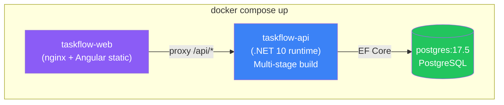
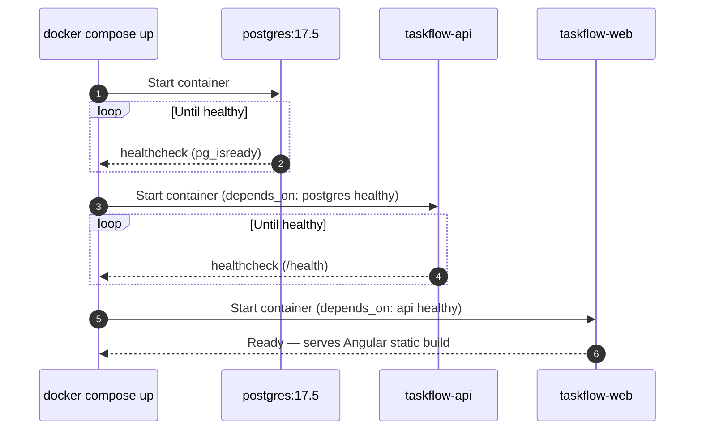

> [📚 INDEX](../INDEX.md) / [EP00](../epics/EP00-project-infrastructure.md) / US-013

# US-013 — Docker Compose Environment

> **Pinned versions**: [README — Version Manifest](../../README.md#version-manifest)

**Epic**: [EP00 - Project Infrastructure](../epics/EP00-project-infrastructure.md)
**Dependencies**: [US-012](US-012-docker-multi-stage-build.md) (requires built Docker images)
**Priority**: Must Have
**Status**: [x] Done (documentation/planning)

## Story

As an **evaluator**, I want to **run `docker compose up` and have the entire system running** so
that **I don't need to install any SDK, Node, or database**.

## Topology

The Compose stack orchestrates exactly 3 containers: `postgres` (database), `taskflow-api`
(.NET 10 runtime), and `taskflow-web` (nginx serving the Angular static build).

| Container | Base Image | Purpose |
| --------- | ---------- | ------- |
| `postgres` | `postgres:17.5` (pinned) | Database — healthcheck via `pg_isready` |
| `taskflow-api` | Multi-stage: .NET SDK → ASP.NET runtime (.NET 10) | Backend API — validates env vars, connects to `postgres` |
| `taskflow-web` | Multi-stage: Node → nginx | Frontend — serves Angular static build, proxies `/api/*` to `taskflow-api` |

## Startup Sequence

## Acceptance Criteria

- [ ] **AC-013.1: Single command starts everything**
  - **Given** a clean clone of the repository with only Docker installed
  - **When** the evaluator runs `docker compose up`
  - **Then** the backend API, frontend, and PostgreSQL database services all start without any
    additional manual setup step

- [ ] **AC-013.2: Backend API is reachable**
  - **Given** the Compose stack is running
  - **When** the evaluator sends a request to the documented backend port
  - **Then** the API responds successfully

- [ ] **AC-013.3: Frontend is reachable**
  - **Given** the Compose stack is running
  - **When** the evaluator opens the documented frontend port in a browser
  - **Then** the Angular application loads and can communicate with the backend API

- [ ] **AC-013.4: Health checks confirm readiness**
  - **Given** the Compose stack has just started
  - **When** dependent services (e.g., `taskflow-api` depending on `postgres`, `taskflow-web`
    depending on `taskflow-api`) start up
  - **Then** Docker Compose health checks confirm each service is ready before dependent services
    are considered started

- [ ] **AC-013.5: Full teardown**
  - **Given** the Compose stack is running
  - **When** the evaluator runs `docker compose down`
  - **Then** all containers, networks, and (unless volumes are explicitly preserved) associated
    resources are removed cleanly

- [ ] **AC-013.6: Environment variable fail-fast validation**
  - **Given** the `taskflow-api` container starting up
  - **When** it reads environment variables from `.env`
  - **Then** it validates all required vars are present and non-empty, and crashes immediately
    with the missing var name if any are absent

- [ ] **AC-013.7: Nginx serves the Angular SPA fallback route**
  - **Given** the `taskflow-web` nginx configuration
  - **When** the evaluator refreshes the browser on a deep Angular client-side route (e.g.
    `/tasks/42`)
  - **Then** nginx serves `index.html` for all non-`/api` routes
    (`try_files $uri $uri/ /index.html`), so Angular client-side routing survives a page refresh

## Ports

| Service | Port | Published to Host |
| ------- | ---- | ------------------ |
| `taskflow-api` | `5000` | Yes — `http://localhost:5000` |
| `taskflow-web` | `4200` | Yes — `http://localhost:4200` |
| `postgres` | `5432` | No — internal to the Docker network only |

## Notes

- Documented ports and the exact `docker compose up` invocation must appear in the project
  README so the evaluator does not need to inspect the Compose file to find them.
- Health checks apply to `postgres` (`pg_isready`) and `taskflow-api` (an HTTP readiness
  endpoint) so no dependent service attempts to call a service before it is ready to accept
  requests.
- This story assumes the images built by US-012 (multi-stage build) are what Compose orchestrates;
  Compose itself does not perform the compilation or test run.
- `.env.example` is committed to the repository with placeholder values so the evaluator can copy
  it to `.env` and fill in real values; `.env` itself is gitignored and never committed.
- The database engine is PostgreSQL in every environment (local, CI, and this Compose demo stack)
  — no SQLite or in-memory provider is used.

## Related Documents

- [Build Pipeline](../architecture/build-pipeline.md) — deterministic 5-stage gated pipeline that
  produces the images this Compose stack runs
- [Tech Stack — Decision 7: Docker Strategy](../architecture/tech-stack.md#decision-7-docker-strategy)
  — rationale for the 3-container topology and multi-stage builds
- [EP00 — Project Infrastructure](../epics/EP00-project-infrastructure.md) — parent epic
