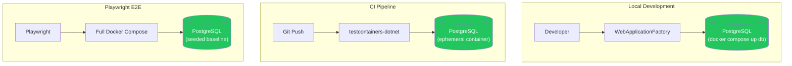

> [📚 INDEX](../INDEX.md) / [EP00](../epics/EP00-project-infrastructure.md) / US-014

# US-014 — Test Infrastructure

> **Pinned versions**: [README — Version Manifest](../../README.md#version-manifest)

**Epic**: [EP00 - Project Infrastructure](../epics/EP00-project-infrastructure.md)
**Dependencies**: [US-013](US-013-docker-compose-environment.md) (requires running compose topology)
**Priority**: Must Have
**Status**: [x] Done (documentation/planning)

## Story

As a **developer**, I want **a test infrastructure that runs integration tests against a real
PostgreSQL database** so that **I have high confidence that my code works the same way in tests,
CI, and the evaluator's Docker Compose demo**.

## Acceptance Criteria

- [ ] **AC-1: Integration tests run against PostgreSQL via WebApplicationFactory**
  - **Given** a developer running the backend integration test suite locally
  - **When** the tests execute
  - **Then** they run against `WebApplicationFactory` connected to a PostgreSQL Docker container
    (started via `docker compose up db`), with real migrations and real constraints

- [ ] **AC-2: CI gate runs against a Docker test container (PostgreSQL)**
  - **Given** a change pushed for CI evaluation
  - **When** the CI pipeline runs the backend integration suite
  - **Then** tests execute against a PostgreSQL Docker test container (`testcontainers-dotnet`)
    for full fidelity — same engine, same migrations, same constraints as production

- [ ] **AC-3: Playwright E2E tests run against a seeded PostgreSQL container**
  - **Given** the frontend E2E suite
  - **When** Playwright specs execute
  - **Then** they run against a real browser, the built Angular app, the API, and a PostgreSQL
    Docker container pre-seeded with a known baseline

- [ ] **AC-4: Test database isolation**
  - **Given** multiple test runs (local or CI) executing over time
  - **When** each run starts
  - **Then** its test database state is isolated from other runs via `Respawn` or per-class
    schema recreation, with no cross-contamination of data between runs

- [ ] **AC-5: AAA pattern and naming convention enforced**
  - **Given** any integration or E2E test in the suite
  - **When** its structure is reviewed
  - **Then** it follows Arrange/Act/Assert and the
    `<Action>_<Scenario>_<ExpectedResult>` naming convention defined in
    [Testing Strategy](../architecture/testing-strategy.md)

- [ ] **AC-6: Unit test projects scaffolded with xUnit and NSubstitute**
  - **Given** the test infrastructure is set up
  - **When** the solution is built
  - **Then** `TaskFlow.Domain.Tests` and `TaskFlow.Application.Tests` projects exist, reference
    xUnit and NSubstitute, and compile successfully

## Test Infrastructure Diagram

## Notes

- This story provides the infrastructure only; the test cases themselves are defined per-AC in
  [Testing Strategy](../architecture/testing-strategy.md) (Sections 3.3, 4.3–4.6) and implemented
  alongside each corresponding user story (EP01, EP02).
- **PostgreSQL is the ONLY database engine** — no EF Core InMemory, no SQLite in-memory. The
  Docker test container runs the exact same PostgreSQL version (`17.5`) used in the Docker Compose
  demo, so migration and constraint behavior in tests matches what the evaluator sees.
- A11y tests (keyboard navigation, ARIA, focus management) are part of the Playwright E2E suite,
  not a separate infrastructure — see [Testing Strategy Section 4.5](../architecture/testing-strategy.md#45-accessibility-a11y-testing).

## Related Documents

- [Testing Strategy](../architecture/testing-strategy.md) — full testing constitution
- [Build Pipeline](../architecture/build-pipeline.md) — how tests fit in the gated pipeline
- [EP00](../epics/EP00-project-infrastructure.md) — parent epic
