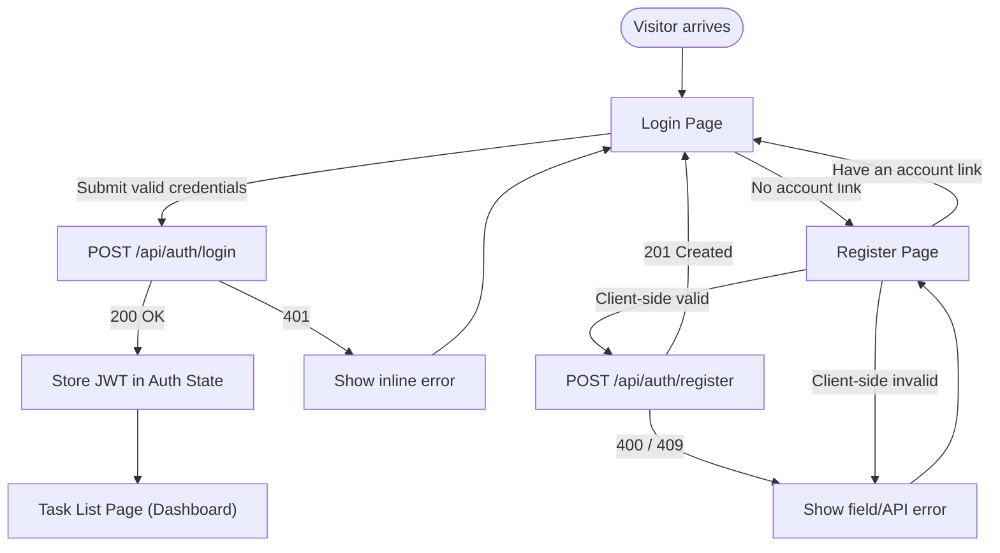

> [📚 INDEX](../INDEX.md) / [EP04](../epics/EP04-frontend.md) / US-016

# US-016 — Login & Registration Screen

**Epic**: [EP04 - Frontend (Angular)](../epics/EP04-frontend.md)
**Priority**: Must Have
**Status**: [ ] Not Started

## Story

As a **visitor**, I want to **register a new account or log in with existing credentials** so that
**I can access my personal task dashboard**.

## Acceptance Criteria

- [ ] **AC-1: Successful login redirects to dashboard**
  - **Given** a visitor on the Login page with a registered email and correct password
  - **When** they submit the login form
  - **Then** the app calls `POST /api/auth/login`, stores the returned access token, and redirects
    to the Task List page

- [ ] **AC-2: Failed login shows an inline error**
  - **Given** a visitor on the Login page with an unregistered email or wrong password
  - **When** they submit the login form
  - **Then** the app displays the generic error message returned by the API (e.g. "Invalid email or
    password.") without navigating away from the Login page

- [ ] **AC-3: Registration with client-side validation**
  - **Given** a visitor on the Register page
  - **When** they submit the form with an invalid email, a weak password, or a missing name
  - **Then** the form shows field-level validation errors before any request is sent to
    `POST /api/auth/register`

- [ ] **AC-4: Successful registration**
  - **Given** a visitor on the Register page with a unique email, valid name, and strong password
  - **When** they submit the form
  - **Then** the app calls `POST /api/auth/register`, and on success either logs the user in
    automatically or redirects them to the Login page with a success message

- [ ] **AC-5: JWT is stored securely**
  - **Given** a successful login or registration-then-login
  - **When** the access token is received from the API
  - **Then** it is persisted using a secure storage mechanism (httpOnly cookie set by a backing
    proxy, or in-memory storage guarded against XSS) rather than in a location trivially readable by
    injected scripts, and is cleared on logout

## Screen Flow

## Related Documents

- [API Contract — Auth API](../architecture/api-contract.md#3-auth-api-public) — register and login
  request/response shapes and error codes
- [Testing Strategy — Frontend Auth Flow Coverage](../architecture/testing-strategy.md#44-auth-flow-coverage)
- [EP04 — Frontend (Angular)](../epics/EP04-frontend.md)
- [US-019 — Responsive Layout & Navigation](US-019-responsive-layout.md) — Auth Guard and redirect
  behavior that follows a successful login
