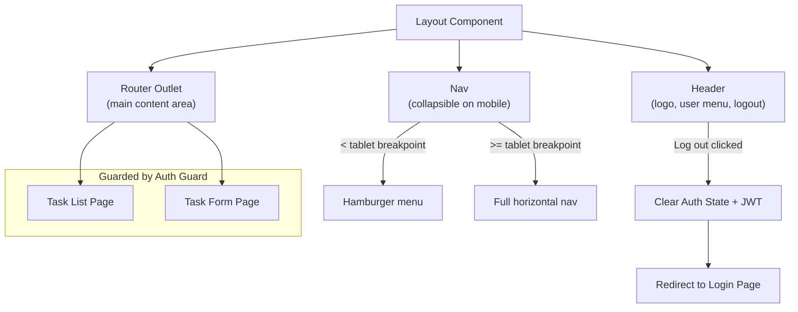

> [📚 INDEX](../INDEX.md) / [EP04](../epics/EP04-frontend.md) / US-019

# US-019 — Responsive Layout & Navigation

**Epic**: [EP04 - Frontend (Angular)](../epics/EP04-frontend.md)
**Priority**: Must Have
**Status**: [ ] Not Started

## Story

As an **authenticated user**, I want to **use the app comfortably on mobile, tablet, and desktop,
and navigate between screens and log out reliably** so that **the application is usable regardless
of my device**.

## Acceptance Criteria

- [ ] **AC-019.1: Responsive across breakpoints**
  - **Given** the app shell (header, nav, main content area) rendered at mobile, tablet, and desktop
    viewport widths
  - **When** the viewport is resized across those breakpoints
  - **Then** the layout adapts (e.g. collapsible nav on mobile, full nav on desktop) without
    horizontal scrolling or overlapping content — satisfying the challenge's "responsive and
    user-friendly" requirement

- [x] **AC-019.2: Navigation between views**
  - **Given** an authenticated user anywhere in the app
  - **When** they use the header/nav to move between Task List and Task Form
  - **Then** the Layout component's router outlet renders the target page without a full page reload

- [x] **AC-019.3: Logout clears auth state**
  - **Given** an authenticated user
  - **When** they select "Log out" from the nav
  - **Then** the app clears the stored JWT and Auth State, and redirects to the Login page

- [x] **AC-019.4: Protected routes redirect to login**
  - **Given** a visitor with no valid token (or an expired token)
  - **When** they navigate directly to a protected route (Task List or Task Form URL)
  - **Then** the Auth Guard intercepts navigation and redirects to the Login page before any
    protected data is fetched

## App Shell Structure

## Related Documents

- [Tech Stack — Decision 5: Frontend Framework](../architecture/tech-stack.md#decision-5-frontend-framework)
  — why Angular was chosen for `taskflow-web`
- [Testing Strategy — Accessibility (A11y) Testing](../architecture/testing-strategy.md#45-accessibility-a11y-testing)
- [EP04 — Frontend (Angular)](../epics/EP04-frontend.md)
- [US-016 — Login & Registration Screen](US-016-login-screen.md) — the redirect target for AC-019.3 and
  AC-4
